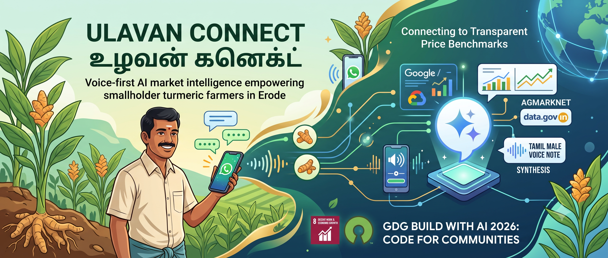
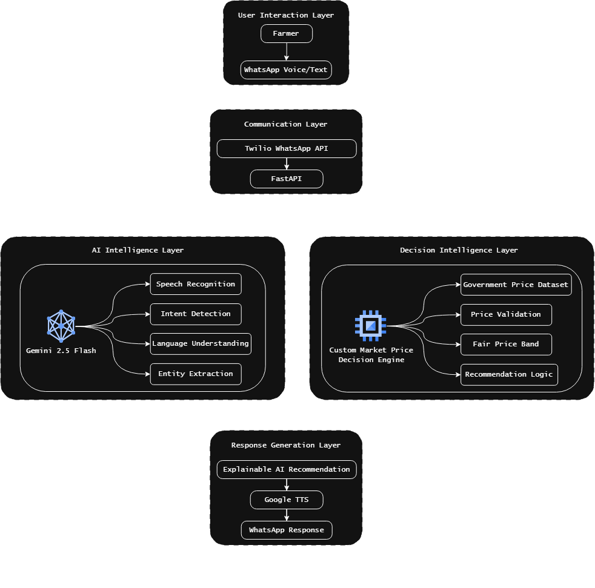

  <!-- Replace with your logo or banner -->
  

  # Ermozhi

  **Restoring economic dignity to the hands that feed us, one spoken truth at a time.**

  
  
  
  

  [Live Demo](https://your-demo-link.com) · [Video Walkthrough](https://youtube.com) · [Report Bug](https://github.com/your-org/your-repo/issues)

---

## 📌 Problem Statement

> Erode, India's leading turmeric hub, cultivates nearly 14,500 hectares of turmeric, contributing 24% of Tamil Nadu's cultivation area and over 33% of the state's production. For this MVP, we focus on the two most traded varieties—Finger (Virali) and Bulb (Kizhangu). However, with over 80% of agricultural holdings classified as small and marginal farmers (<2 hectares), many farmers lack access to verified market prices, causing price negotiations to be driven by traders rather than transparent market data.
>>Community Empathy
>>Every harvest season, thousands of smallholder turmeric farmers in Erode must decide whether to accept a trader's offer without knowing the latest market price for Finger (Virali) or Bulb (Kizhangu) turmeric. A price gap of just ₹800–₹1,200 per quintal across a typical harvest of 10–30 quintals can significantly reduce seasonal income, leaving farmers with limited bargaining power and lower returns for their produce.
>
## 💡 Our Solution

Ermozhi is a WhatsApp-based AI assistant that enables smallholder turmeric farmers in Erode to verify trader offers through simple Tamil voice or text conversations. The system uses Gemini AI to understand farmer queries, extract transaction details, and compare them against live government market price data (AGMARKNET/data.gov.in) for Finger (Virali) and Bulb (Kizhangu) turmeric varieties. Using a transparent AI-powered decision engine, the platform classifies offers as Fair Price, Negotiate, or Too Low, and delivers evidence-backed recommendations in Tamil within minutes. By leveraging widely available mobile phones and scalable cloud infrastructure, the solution can expand from one crop and district to multiple crops, regions, and farming communities across India.

### 🎯 Alignment with UN Sustainable Development Goals (SDGs)
* **Target SDGs:** Goal 2 — Zero Hunger and Goal 8 — Decent Work and Economic Growth
* **Community Impact:** _By providing real-time, AI-powered market price verification for turmeric farmers, Ermozhi reduces information asymmetry in agricultural trade and strengthens farmers' negotiating power. The solution aims to help smallholder farmers secure fairer prices, potentially increasing seasonal income by ₹8,000–₹36,000 per harvest (10–30 quintals), while promoting inclusive economic growth and improving livelihood resilience in rural farming communities._

## ✨ Key Features

- 🎙️ **Tamil Voice & Text Interaction:** Farmers can ask about trader offers using simple Tamil voice notes or text messages through WhatsApp, eliminating the need for a dedicated mobile application.

- 🤖 **AI-Powered Market Intelligence:** Gemini AI extracts turmeric variety, offered price, and transaction details, then compares them against verified government market data to generate explainable recommendations.

- 📊 **Real-Time Price Verification:** Fetches the latest AGMARKNET market prices through the data.gov.in API and evaluates trader quotations as **Fair Price**, **Negotiate**, or **Too Low** using a transparent decision engine.

- 🗣️ **Evidence-Based Negotiation Support:** Provides farmers with Tamil recommendations backed by current market prices, helping them negotiate confidently using verified data rather than assumptions.

- ⚡ **Fast & Accessible:** Delivers recommendations within minutes using WhatsApp—the communication platform already familiar to farmers—without requiring additional training or software installation.

- ☁️ **Scalable Rural AI Infrastructure:** Designed as a cloud-native solution that can be expanded from turmeric in Erode to multiple crops, districts, and farming communities across India.

## 🛠️ Tech Stack

| Domain | Technology |
|---|---|
| **Frontend / Messaging** | Meta WhatsApp Cloud API |
| **Backend** | Python FastAPI (Async Ingress & Worker) |
| **AI / ML** | Gemini 3.5 Flash Lite (Multimodal Audio & Text) |
| **Data & Storage** | Azure Blob Storage (Zero-Disk Storage) |
| **Deployment** | Azure Container Apps (ACA) / Key Vault / Log Analytics |

## 🏗️ System Architecture

## 🚀 Quick Start Guide

Follow these steps to run and test the Ermozhi AI pipeline locally on your machine.

### Prerequisites
- Python 3.11+ installed
- Active Meta WhatsApp Developer Account
- API Keys for Google Gemini, Meta WhatsApp Cloud API, and Data.gov.in

---

## License

Source Code: Apache License 2.0

Documentation and educational content:
CC BY 4.0
https://creativecommons.org/licenses/by/4.0/
