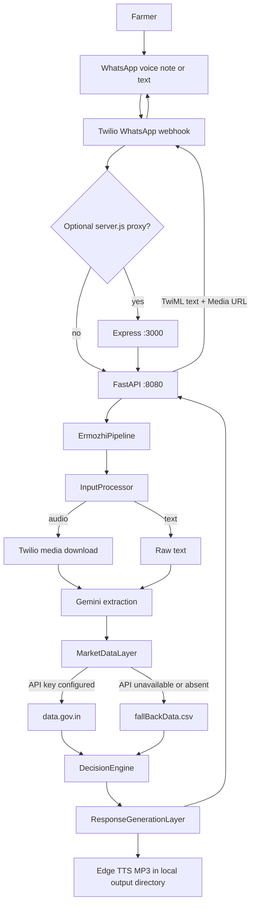
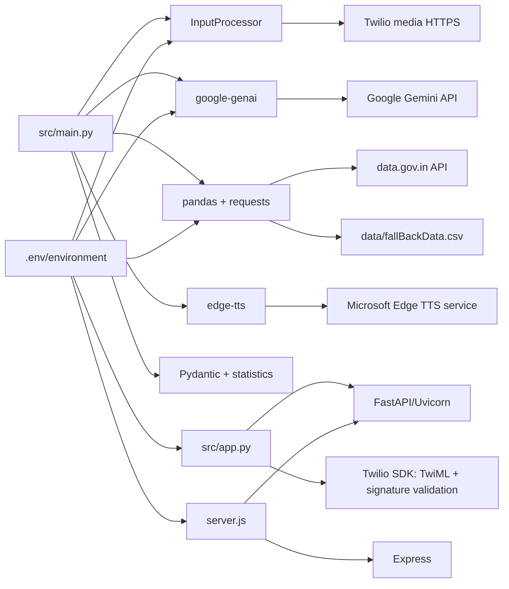
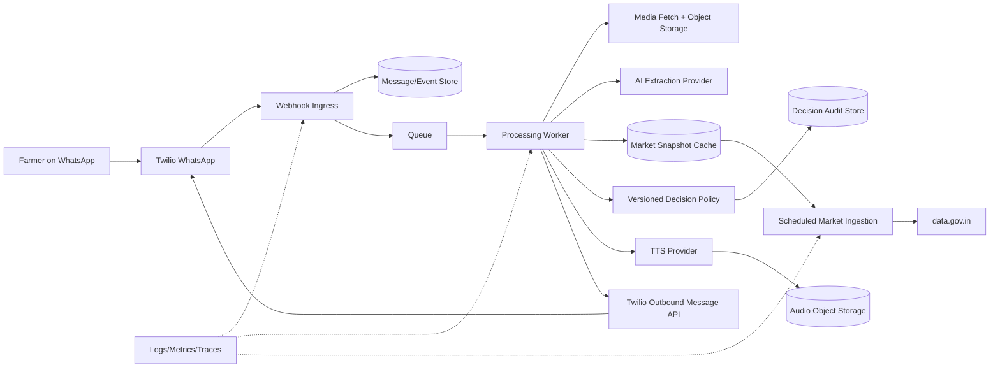

# Ermozhi — Architecture Review

Review scope: `E:\\Program Files\\vs code\\Decillium_farmerProduct` (the accessible repository matching the supplied project name is `Decillium_farmerProduct`, not a nested `Decillium\\_farmerProduct` directory).

Review type: documentation and understanding only. No application code was changed.

## Executive summary

The repository contains a working hackathon MVP for price-checking turmeric trader offers through WhatsApp. The implemented runtime is:

1. Twilio WhatsApp sends a form-encoded webhook.
2. FastAPI receives `/whatsapp` or `/webhook`.
3. The pipeline downloads voice media when present, or uses text.
4. Gemini extracts turmeric variety and offered price.
5. A market-data adapter reads `data.gov.in` when configured, otherwise a bundled CSV.
6. A deterministic decision engine compares the offer to a seven-record median.
7. Edge TTS creates a Tamil MP3, and FastAPI returns TwiML containing text plus a public audio URL.

There is no frontend application, database, background worker, durable conversation store, authentication/user system, or production-grade observability. `server.js` is an optional Node.js forwarding proxy, but it is not required by the primary FastAPI path.

The implementation is a credible demo slice, not production-ready despite documentation using that phrase. The largest risks are synchronous long-running work inside an async webhook request, ephemeral local audio storage, inconsistent documented versus implemented thresholds/models/providers, optional signature verification, and unsafe media fetching when verification is disabled.

## 1. Repository structure

```text
Decillium_farmerProduct/
├── src/
│   ├── app.py                         FastAPI routes, TwiML, config, signature check
│   ├── main.py                        Pipeline orchestrator
│   ├── input_process_layer.py         Text/audio classification and Twilio media download
│   ├── gemini_intelligence_layer.py   Gemini structured extraction
│   ├── market_data_layer.py           data.gov.in + CSV fallback adapter
│   ├── decision_engine_layer.py       Median, variance, classification, confidence
│   ├── response_generation_layer.py   Tamil text + Edge TTS MP3 generation
│   ├── twilio_webhook_layer.py        Legacy/unused payload helper
│   ├── twilio_logger.py               Diagnostic Twilio REST API script
│   └── README.md                      Placeholder
├── data/
│   └── fallBackData.csv               Bundled market records; ~9 MB
├── output_audio/                      Generated MP3 artifacts committed/present locally
├── tests/
│   ├── test_e2e.py                    Flask-named but tests FastAPI pipeline behavior
│   ├── test_error_simulation.py       Manual running-server error check
│   ├── test_signature.py              Manual signature scenarios
│   └── curl_test_suite.ps1            Manual HTTP smoke suite
├── server.js                          Optional Node/Express Layer 1 proxy
├── Dockerfile                         Python Cloud Run image
├── requirements.txt                   Python dependencies
├── package.json / package-lock.json   Node proxy dependencies
├── README.md / PROPOSAL.md / docs/    Product and architecture narratives
├── TWILIO_SETUP.md                    Sandbox/ngrok setup
├── verify_connection.py               Manual FastAPI/TwiML verification
├── test.py                             Manual data.gov.in API probe
├── test_layer2.py                     Manual FastAPI smoke suite
└── .github/                            Hackathon issue templates
```

Binary assets include two architecture/banner PNGs and fourteen generated MP3 files. There is no frontend source tree, schema/migration directory, CI workflow, infrastructure-as-code, `.env.example`, or database configuration.

## 2. Implemented components

| Area | What exists today | Assessment |
|---|---|---|
| Frontend | WhatsApp is the only user interface | No React/Next/Tailwind app exists in this repository |
| Edge/API | FastAPI in `src/app.py` | Primary runtime entry point; synchronous business work is invoked from async handlers |
| Optional gateway | Express in `server.js` | Forwards a reduced Twilio payload to FastAPI; duplicates routing responsibility |
| AI | Gemini SDK in `gemini_intelligence_layer.py` | Structured extraction from text or audio; model fallback list is hard-coded |
| Market data | data.gov.in adapter plus CSV fallback | No cache, freshness metadata, provenance record, or scheduled ingestion |
| Decisioning | Pydantic-backed deterministic Python rules | Core business logic is explainable, but thresholds differ from the documents |
| Voice output | Edge TTS `ta-IN-ValluvarNeural` | Despite docs claiming Google TTS/gTTS, implementation uses Edge TTS |
| Database | None | No persistence of users, requests, conversations, decisions, or audit history |
| WhatsApp | Twilio webhook + TwiML response | Sandbox-oriented; inbound message response is synchronous |
| Cloud | Dockerfile targeting Cloud Run; `/tmp` audio on Linux | No deployment manifest, secrets integration, autoscaling policy, or durable object storage |

## 3. Current system flow



### User request flow

The request is form-encoded with `From`, `Body`, `NumMedia`, `MediaUrl0`, and `MediaContentType0`. FastAPI normalizes the sender and media count, rejects unsupported media types, and sends the payload into the pipeline. A successful request returns TwiML with a Tamil text summary and, when generation succeeds, a `<Media>` URL. Missing variety or price returns a Tamil clarification message. Any pipeline exception is converted to a polite Tamil error response while the HTTP status remains 200.

### Data flow

```text
Twilio form payload
  -> normalized dictionary
  -> audio bytes OR text string
  -> ExtractedMarketData Pydantic object
       variety, offered_price_per_quintal, quantity, intent, language
  -> market payload
       variety, last_7_day_prices
  -> DecisionOutput Pydantic object
       offer, median reference, difference, decision, confidence, reason
  -> AudioResponseMetadata
       Tamil summary, MP3 path, language
  -> TwiML response
```

The sender phone number is parsed for logging but is not passed into the domain pipeline and is not persisted. Quantity is extracted by Gemini but is not used in the decision or response. The market response does not retain dates, market names, source, or freshness, only a price array.

### Inference flow

Gemini is used for semantic extraction, not for the final price recommendation. It receives either raw text or audio bytes and a JSON schema. The schema validator resets non-positive prices, requires both variety and price, and forces `CLARIFICATION_NEEDED` when either is missing. Model calls try the configured model followed by three hard-coded fallbacks. The final classification is deterministic Python logic based on the median of the returned prices.

## 4. Dependency diagram



## 5. Architecture assessment

### What exists today

- A narrow, end-to-end price-verification slice for Erode turmeric.
- Tamil/English text and audio input paths.
- Structured extraction with Pydantic validation.
- Live market API attempt with a local fallback dataset.
- Explainable rule-based price classification.
- Tamil text and synthesized voice output.
- Twilio signature validation capability, disabled by default.
- Health endpoint and basic request-ID logging.
- Docker image definition for Cloud Run.
- Manual, unit-style, and integration-style tests around the webhook/pipeline.

### What is missing

- Any actual browser/mobile frontend.
- Persistent database and data model.
- Conversation/session state or follow-up context.
- Durable job queue/background worker for media, Gemini, and TTS.
- Durable audio object storage and lifecycle cleanup.
- Formal market-data ingestion, normalization, freshness, and provenance service.
- User identity, authorization, rate limiting, abuse prevention, and tenant isolation.
- Secrets manager integration and environment validation at startup.
- Structured logs/metrics/traces and correlation across the optional proxy.
- Retry/backoff/circuit-breaker policies for all external dependencies.
- Idempotency and duplicate Twilio webhook handling.
- Contract/schema tests for data.gov.in responses and Gemini outputs.
- CI/CD, deployment manifests, versioned configuration, migrations, and rollback strategy.
- Privacy, retention, consent, and deletion policies for phone numbers, voice notes, and generated audio.

### What should remain unchanged

- WhatsApp as the farmer-facing channel for the MVP/pilot.
- The narrow domain scope until real farmer feedback supports expansion.
- Deterministic decisioning after AI extraction; keep the recommendation auditable.
- Pydantic schemas as explicit contracts between pipeline stages.
- A local fallback path for market data, provided it is versioned and freshness-labeled.
- Tamil-first response templates and clarification behavior.
- The separation between extraction, market lookup, decisioning, and response generation as conceptual boundaries.

### What should be redesigned

1. Make one service the canonical ingress. Prefer FastAPI directly behind a managed HTTPS endpoint; remove the Node proxy unless it gains a clear responsibility.
2. Split webhook acknowledgement from processing. Validate and enqueue the request quickly, then process audio/Gemini/market/TTS asynchronously and send the eventual WhatsApp reply through the Twilio REST API.
3. Introduce a durable data layer for user/session state, message events, extracted entities, market snapshots, decisions, and audit records.
4. Store generated media in object storage with signed/publicly retrievable URLs and TTL cleanup, not the container filesystem.
5. Create a market-data service/cache with explicit source timestamp, arrival date, market, variety mapping, unit, and fallback status.
6. Centralize business policy configuration so documented thresholds and code cannot drift.
7. Add a provider abstraction for Gemini, TTS, Twilio, and market data, with bounded retries, timeouts, circuit breakers, and observable failures.
8. Enforce Twilio signature validation at the only public ingress and protect media downloads from SSRF and unbounded payloads.
9. Add privacy controls and operational controls before any real farmer pilot.

## 6. Technical debt and prototype shortcuts

### High risk

- `VERIFY_TWILIO` defaults to false. The public webhook can therefore be called without proving it came from Twilio.
- `InputProcessor._download_media()` accepts a URL from the request and sends Twilio credentials when configured. Without signature enforcement, this creates an SSRF/credential-exposure risk.
- The async FastAPI route calls blocking `requests`, Gemini SDK, pandas CSV reads, and TTS work in the request path. Concurrency and webhook latency will degrade under load.
- Twilio expects a prompt response, but the handler waits for external AI, data, and TTS calls before responding. Slow/failing dependencies can trigger retries and duplicate processing.
- Audio files are written to local disk. Cloud Run filesystem behavior is ephemeral and instance-local; a later TwiML media fetch may hit another instance or a deleted file.
- There is no cleanup of generated audio, so a warm instance can accumulate files.
- No idempotency key or event store exists; Twilio retries can produce duplicate AI calls and duplicate replies.

### Medium risk

- The business rules in `PROPOSAL.md`/`docs/README.md` say 78%/70%, while the implemented engine uses 98%/90%.
- Documentation alternates between Flask and FastAPI, Gemini 1.5/2.5/3.5, Google TTS/gTTS and Edge TTS, CSV and live API, and React/Next.js despite no frontend.
- The configured Gemini default `gemini-3.5-flash-lite` and fallback list are hard-coded and not centrally validated against deployment availability.
- The market adapter silently defaults unknown varieties to Finger and, if a variety match is absent, falls back to all Erode turmeric records. This can produce a confident but wrong recommendation.
- “Last 7 days” is implemented as the seven most recent records, not necessarily seven distinct dates, markets, or a consistently filtered market/grade.
- The live API requests only 50 records and depends on response field casing/schema assumptions.
- Quantity is extracted but ignored, preventing total-value impact calculations and leaving a misleading schema field.
- All pipeline exceptions become HTTP 200 TwiML messages, making monitoring and Twilio delivery diagnostics harder.
- The optional `server.js` proxy forwards only selected fields and does not forward the original Twilio signature. If FastAPI signature verification is enabled behind it, the proxy path will fail unless verification is moved to the proxy or the original request/signature is preserved correctly.

### Low risk / maintainability

- Multiple modules call `logging.basicConfig`, and request IDs are not consistently propagated across layers.
- `twilio_webhook_layer.py` duplicates webhook parsing/security concepts but is not used by `src/app.py`.
- `src/app.py` imports `Form`, `Optional`, and `Response` redundantly; `Response` is imported from two places.
- The package has generated artifacts and `__pycache__` files but no clear artifact policy.
- Tests are largely manual smoke tests and mocks; there is no repeatable CI test command defined in `package.json` or a Python project configuration.
- Several docs contain stale paths, placeholder links, aspirational claims, and hackathon submission language.

## 7. Hackathon-specific implementation signals

- Scope is deliberately one district, one crop, two varieties, and one channel.
- The fallback CSV is bundled to guarantee a demo when the government API/key is unavailable.
- The response is synchronous and returns TwiML directly, avoiding a queue and outbound messaging workflow.
- Threshold-based classification replaces a trained pricing model.
- Local `output_audio` artifacts and generated sample MP3s support demonstrations but are not a production media strategy.
- `server.js`, duplicated scripts, and legacy layer files indicate parallel team work and integration experimentation.
- `MILESTONES.md`, proposal deadlines, sandbox/ngrok instructions, and manual curl scripts are process artifacts from the event rather than runtime architecture.

## 8. Production risks by category

| Category | Risk | Consequence |
|---|---|---|
| Correctness | Threshold/documentation drift; broad variety fallback | Wrong farmer recommendation |
| Availability | External calls block webhook; no queue/retry strategy | Twilio timeouts, retries, slow responses |
| Security | Signature check off by default; URL-based media fetch | Spoofed requests, SSRF, credential leakage |
| Data durability | No database; local ephemeral audio | No audit trail, lost media, no support history |
| Privacy | Audio/phone data has no retention policy | Uncontrolled sensitive-data retention |
| Observability | Print statements/manual scripts; HTTP 200 on errors | Failures difficult to detect and measure |
| Deployment | No IaC/CI/CD/secrets manager/object storage | Fragile releases and operational drift |
| Vendor dependency | Gemini, data.gov.in, Twilio, Edge TTS all synchronous | One provider outage stalls the full response |
| Domain risk | Government market record freshness and grade comparability unclear | Advice may be stale or not comparable to farm-gate offer |

## 9. Recommended target architecture



The target architecture keeps the current domain boundaries but changes the runtime contract: the ingress acknowledges quickly, the worker owns retries and orchestration, all meaningful state is durable, market evidence is versioned, and outbound replies are observable and idempotent.

## 10. Prioritized redesign sequence

### Before pilot

1. Reconcile the canonical product/runtime documentation and select one framework/provider/model.
2. Enable and test signature verification at the public boundary; remove the unsigned default.
3. Constrain and authenticate media downloads; cap size/type/time and allow only Twilio media hosts or validated signed URLs.
4. Move processing behind a queue and outbound Twilio send flow.
5. Add object storage for audio and persistent records for messages, decisions, and source market evidence.
6. Version thresholds and variety mappings; add golden test cases for Tamil/English inputs and ambiguous varieties.

### Before production

1. Add identity, consent, retention/deletion, rate limits, abuse controls, and secret management.
2. Add data freshness/provenance checks and fail closed when the variety/market evidence is not comparable.
3. Add structured telemetry, alerting, dead-letter handling, replay tooling, and idempotency.
4. Establish CI/CD, dependency pinning, infrastructure-as-code, deployment health checks, and rollback.
5. Run a farmer pilot with measured extraction accuracy, recommendation correctness, latency, delivery rate, and real economic outcomes.

## Final assessment

The codebase demonstrates the core idea end to end and has a sensible conceptual decomposition for a hackathon. The main architectural work ahead is operationalizing that decomposition: durable state, asynchronous processing, secure ingress/media handling, evidence freshness, and a single source of truth for policy and documentation. The recommendation logic should remain deterministic and auditable; the transport, persistence, and integration layers should be redesigned around production reliability.

