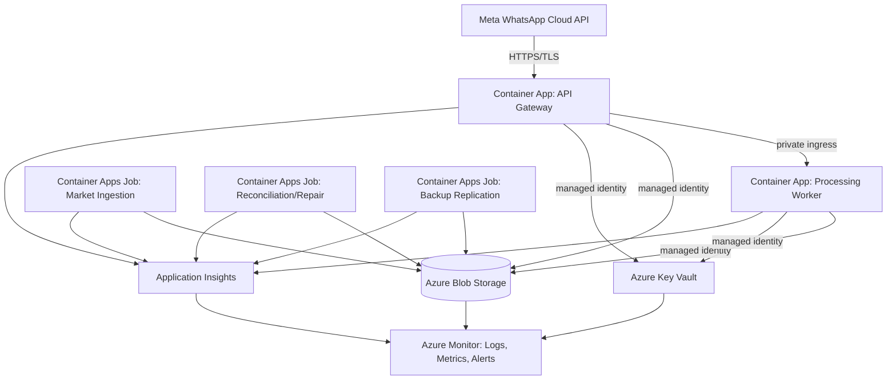
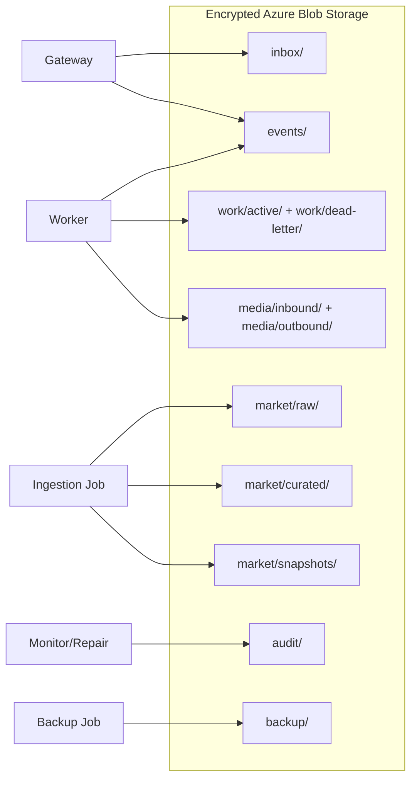
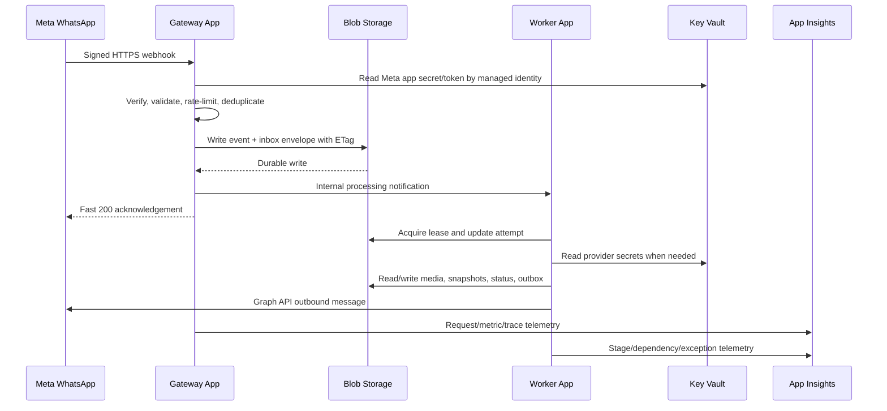
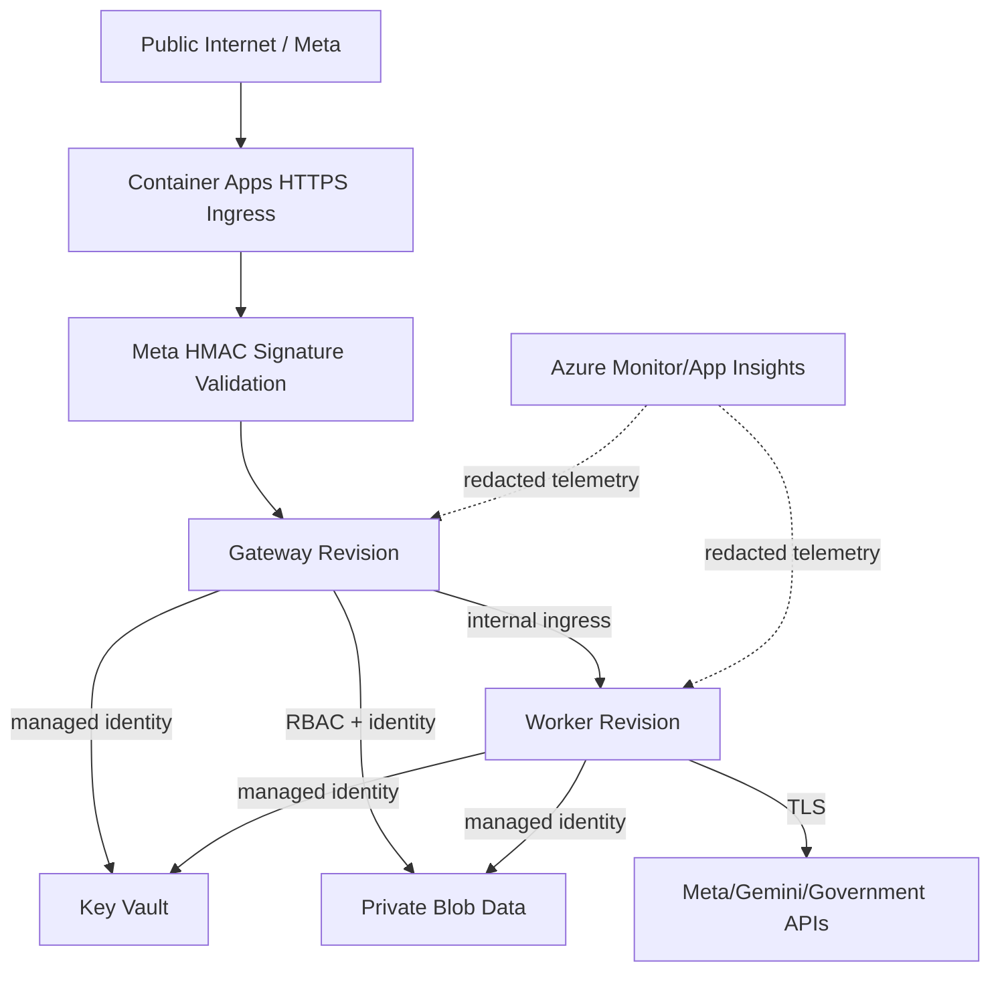
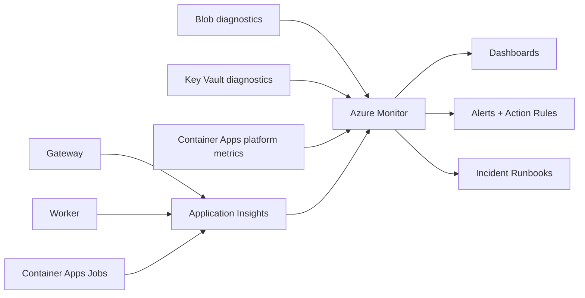
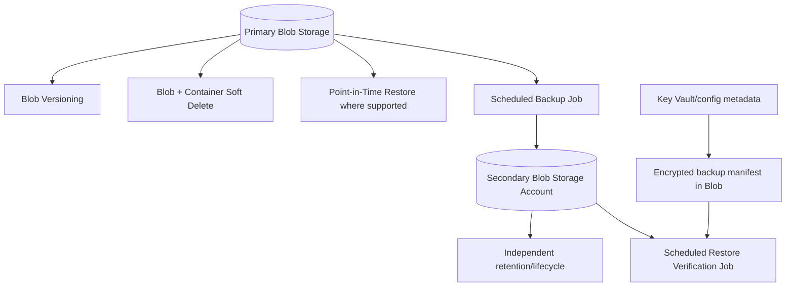

# Ermozhi — Azure Cloud Architecture

**Role:** Principal Azure Cloud Architecture design  
**Status:** Proposed production deployment  
**Allowed Azure services:** Azure Container Apps, Azure Blob Storage, Azure Key Vault, Azure Monitor, Azure Application Insights  
**Baseline:** Existing `overView/ARCHITECTURE_REVIEW.md`, `PRODUCTION_ARCHITECTURE_REDESIGN.md`, Data Layer, Gateway, Intelligence, Decision, Language, and Meta WhatsApp documents

This is architecture and deployment documentation only. No implementation code is included.

The design deliberately stays within the allowed service set. Because a managed relational database and a dedicated queue are not included, Blob Storage is used for durable event envelopes, inbox/outbox work items, media, raw market data, and immutable snapshots. That is a practical constrained deployment, but it is less query-friendly than a database/queue architecture and should be revisited if those services become available.

Azure behavior, quotas, pricing, and supported scale rules change. Validate the selected region, Container Apps environment mode, storage redundancy, and pricing calculator estimate before production approval.

## 1. Deployment architecture

### 1.1 Azure resources

| Resource | Role | Ingress | State |
|---|---|---|---|
| Container Apps environment | Shared managed runtime boundary | Private/internal and public app ingress as configured | Platform configuration |
| Gateway Container App | Meta webhook verification, signature validation, canonical event admission, health endpoints | Public HTTPS only for webhook; strict routes | Stateless |
| Processing Worker Container App | Intelligence, Data, Decision, Language, outbound orchestration | Internal ingress only | Stateless; leases work from Blob |
| Scheduled Container Apps Jobs | Market ingestion, rolling snapshot rebuild, reconciliation, backup replication, cleanup | No public ingress | Finite execution |
| Blob Storage account(s) | Events, work items, media, raw data, snapshots, audit, backups | Private service access; no anonymous containers | Durable system of record within this constrained design |
| Key Vault | Meta/Gemini/data-source credentials, signing material, configuration secrets | Azure identity only | Secret store |
| Application Insights | Request, dependency, trace, exception, custom event telemetry | SDK/agent ingestion | Observability data |
| Azure Monitor | Metrics, logs, alerts, dashboards, action rules | Operator access | Operations |

### 1.2 Container Apps layout

Use one Container Apps environment per lifecycle boundary, at minimum:

- `ermozhi-prod` for production;
- `ermozhi-staging` for pre-production verification;
- separate development environments or local execution for developers.

Within production, use separate apps/jobs for distinct scaling and failure domains:

1. `gateway`: public Meta webhook and internal health/metadata endpoints.
2. `worker`: internal processing and outbound delivery orchestration.
3. `market-ingestion-job`: scheduled source retrieval and normalization.
4. `reconciliation-job`: recent-window repair and snapshot validation.
5. `backup-job`: secondary Blob replication and restore verification.
6. `cleanup-job`: lifecycle checks, expired media purge, stale work-item handling.

Do not run ingestion, AI processing, and public ingress in one Container App. Their traffic, quotas, failures, and scaling needs differ.

## 2. Data and storage layout

### 2.1 Blob containers and retention

| Container/prefix | Contents | Suggested retention |
|---|---|---:|
| `inbox/` | Canonical accepted event envelopes awaiting processing | Until terminal state plus replay window |
| `events/` | Immutable inbound/outbound/status event records | Long-term audit policy |
| `work/active/` | Leased processing envelopes and attempt metadata | Until completed/dead-lettered |
| `work/dead-letter/` | Failed events with diagnostics and replay references | Operational retention, then archive/delete |
| `media/inbound/` | Farmer audio and future supported media | Short, consent/retention-controlled period |
| `media/outbound/` | TTS audio objects | Short TTL; reusable audio may have bounded cache retention |
| `market/raw/` | Exact AGMARKNET/data.gov.in responses and manifests | Historical/audit policy |
| `market/curated/` | Normalized observations and dimension mappings | Historical policy |
| `market/snapshots/` | Immutable 7-day/30-day decision snapshots | Keep versions used by decisions |
| `audit/` | Data access, deployment, replay, and repair records | Compliance/operations policy |
| `backup/` | Replicated backup manifests and copies | Independent backup retention |

Use deterministic object names containing environment, date partition, event/message ID, and schema version. Avoid putting full phone numbers or secrets in object names.

### 2.2 Blob-only event durability trade-off

With only the allowed services, the platform uses:

- immutable JSON event blobs as the source of truth;
- blob leases to prevent concurrent processing;
- status/index blobs for idempotency and lookup;
- `inbox/` as a durable work backlog;
- Container Apps worker calls for low latency;
- scheduled reconciliation jobs to find orphaned/unleased work.

This provides durability and replay but not database-style ad-hoc queries or queue-native visibility. Blob object naming, leases, ETags, and append-only manifests must be treated as explicit contracts. If Azure Storage Queue or a database is later permitted, migrate work dispatch and operational indexing while preserving event/object IDs.

## 3. Request deployment flow

If the internal worker notification fails, the event remains in `inbox/`; the worker or reconciliation job discovers it by lease/state scan. The gateway must never acknowledge an event before the Blob write succeeds.

## 4. Deployment process

### 4.1 Environment provisioning

Document and version the following resource settings outside application code:

1. Azure subscription, region, resource group, tags, and environment name.
2. Container Apps environment and revision mode.
3. Gateway/worker ingress, target ports, health probes, CPU/memory, min/max replicas.
4. Scheduled Container Apps Jobs and UTC cron schedules.
5. Storage account redundancy, containers, lifecycle rules, versioning, soft delete, and access policies.
6. Key Vault secrets, RBAC assignments, rotation owners, and expiry alerts.
7. Application Insights connection configuration and sampling/retention settings.
8. Azure Monitor dashboards, alerts, action rules, and diagnostic settings.

### 4.2 Application deployment

1. Build an immutable container image from the existing FastAPI service and worker entry points.
2. Deploy the image as a new Container Apps revision.
3. Run startup/readiness checks for configuration shape, Blob access, Key Vault identity, and telemetry.
4. Send synthetic webhook and worker test events in staging.
5. Use revision labels/traffic splitting for canary validation.
6. Shift production traffic only after error rate, latency, queue/backlog, and delivery checks pass.
7. Keep the prior revision available for rapid rollback until the new revision is proven.

Container Apps revisions are immutable deployment snapshots; deployment documentation must record image digest, revision name, schema/policy versions, and traffic allocation.

### 4.3 Configuration separation

Non-secret configuration:

- environment name and region;
- Blob prefixes and retention policies;
- scale bounds and deadlines;
- Graph API version and Meta IDs;
- active model/policy/template versions;
- logging/sampling settings.

Secrets in Key Vault:

- Meta app secret, webhook verify token, system-user access token;
- Gemini and data-source credentials;
- any signing/encryption secrets.

Containers must not contain `.env` files or long-lived credentials.

## 5. Scaling architecture

Azure Container Apps supports declarative horizontal scaling and revisions; use separate rules per app/job. Scale-to-zero can reduce idle cost, but a component that must poll Blob inboxes needs a minimum replica or a scheduled job that wakes it. Azure Container Apps Jobs support scheduled, manual, and event-driven execution; this design uses scheduled jobs because the allowed service list does not include a dedicated queue.

### 5.1 Gateway scaling

- Public HTTPS ingress enabled only on the gateway.
- Minimum replicas: one for production webhook readiness; increase if acknowledgement SLO requires it.
- Maximum replicas: set from load testing and Meta delivery burst expectations.
- Scale on HTTP concurrency/request rate and CPU/memory guardrails.
- Keep request work limited to verification, validation, Blob persistence, and worker notification.

### 5.2 Worker scaling

- Internal ingress enabled for low-latency gateway notification.
- Worker acquires Blob leases before processing.
- Scale on internal HTTP concurrency/CPU plus an application backlog metric emitted to Azure Monitor.
- Keep at least one replica when using continuous Blob polling; otherwise use a scheduled reconciliation job to permit scale-to-zero.
- Set independent concurrency budgets for media, AI, Data, TTS, and Meta outbound calls.

### 5.3 Job scaling

- Market ingestion: scheduled execution based on source freshness windows.
- Reconciliation: scheduled execution more frequently than full ingestion when backlog or failures are detected.
- Backup: scheduled execution with bounded parallel blob copies.
- Cleanup: scheduled execution for expired media, old work records, and old blob versions.

Jobs should process finite bounded batches, write checkpoints, and be safe to rerun.

### 5.4 Backpressure

- Stop accepting new work when Blob write or Key Vault access cannot guarantee durability/authentication.
- Limit active blob leases per worker.
- Cap AI/TTS/Meta concurrent calls to provider quotas.
- Let backlog age trigger alerts before scaling limits are exhausted.
- Route exhausted attempts to dead-letter prefixes, never delete silently.

## 6. Security architecture

### Controls

- Public exposure is limited to the gateway webhook and health endpoints required by the platform.
- Container Apps worker/jobs use internal ingress or no ingress.
- Use system-assigned or user-assigned managed identities for Blob and Key Vault access; avoid storage keys and hard-coded secrets.
- Use Key Vault RBAC and least-privilege roles; separate read-only runtime access from operator administration.
- Disable anonymous Blob access; use private containers and identity-based access.
- Validate Meta signatures before parsing/trusting webhook fields.
- Restrict outbound media retrieval to validated provider URLs and bounded size/type/time.
- Encrypt data at rest and in transit; separate raw media access from market snapshot access.
- Redact phone numbers, tokens, media URLs, raw prompts, and audio from logs and traces.
- Use resource locks and separate production resource groups to protect storage and Key Vault from accidental deletion.
- Treat Application Insights data as sensitive; apply retention, sampling, and access controls.

The allowed service list does not include a dedicated WAF or network firewall. Signature validation, strict ingress, managed identity, RBAC, and rate limits at the Gateway are therefore mandatory compensating controls. Add a WAF/private networking tier when the platform scope permits it.

## 7. Cost optimization

### Container Apps

- Use scale-to-zero for scheduled/batch apps where recovery latency permits.
- Keep the gateway minimum replica at the lowest level consistent with webhook SLO.
- Use separate worker/job profiles so ingestion or TTS bursts do not keep the gateway overprovisioned.
- Set maximum replicas, concurrency, CPU, memory, execution timeout, and retry bounds.
- Remove inactive revisions after rollback windows; keep only the versions needed for recovery.
- Use jobs for finite ingestion/cleanup work rather than permanently running replicas.

### Blob Storage

- Store small event/status JSON separately from large audio/raw payloads.
- Use hot tier only for recent events, snapshots, and active media.
- Move raw historical data and old audit objects to cool/archive tiers according to access frequency and regulatory needs.
- Apply lifecycle rules to outbound audio and expired inbound media.
- Delete old blob versions through lifecycle rules because versioning increases stored bytes.
- Avoid rewriting large blobs; use immutable versioned objects and small manifests.

### Key Vault

- Cache secrets in memory for a bounded lifetime rather than reading Key Vault on every request.
- Rotate on schedule and invalidate the in-process cache after rotation.
- Keep secret count and request rate modest; do not use Key Vault as a general configuration database.

### Monitor and Application Insights

- Use adaptive sampling for high-volume success telemetry while retaining all failures/security events.
- Do not send raw payloads or audio as custom dimensions.
- Set explicit retention and daily ingestion alerts.
- Use structured metrics instead of verbose per-field logs.
- Separate staging and production telemetry to control retention and query cost.

### Cost governance

Track monthly cost by resource tag, environment, and workload:

- gateway compute;
- worker compute;
- job executions;
- Blob capacity, transactions, egress, version/soft-delete retention;
- Key Vault operations;
- Monitor/Application Insights ingestion and retention.

Set budget alerts before production scale-out and review cost per farmer request, audio request, AI extraction, and successful delivery.

## 8. Monitoring architecture

### Golden signals

- **Traffic:** webhook requests, accepted events, worker jobs, ingestion batches.
- **Latency:** webhook acknowledgement, Blob persistence, processing stages, outbound delivery, job duration.
- **Errors:** signature failures, validation errors, Blob failures, Key Vault failures, provider 4xx/5xx/429, dead letters.
- **Saturation:** replica count, CPU/memory, Blob backlog/lease age, provider concurrency, daily telemetry ingestion.

### Required correlation fields

`request_id`, `correlation_id`, `message_id`, `conversation_id`, `provider_event_id`, `blob_object_id`, `lease_id`, `attempt`, `revision_name`, and `policy_version`.

### Alerts

- Gateway readiness failures or public 5xx rate above threshold.
- Signature failures above baseline.
- Blob write/lease errors or storage throttling.
- Key Vault access failures, secret expiry, or unusual access.
- Worker backlog age and dead-letter growth.
- Meta/Gemini/data-source failure and 429 rates.
- App Insights ingestion volume/cost threshold.
- Backup job failure or last-success age exceeding RPO.
- Blob soft-delete/version retention approaching capacity budget.

Health checks:

- **Liveness:** process is responsive; no external dependency calls.
- **Readiness:** gateway can authenticate configuration, write a test/real event safely, and reach the worker path; worker can access Blob/Key Vault as required.
- **Dependency health:** recorded as metrics and alerts, not used to make liveness fail unnecessarily.

## 9. Backup strategy

### Blob protection

- Enable blob versioning for raw source, event, snapshot, and audit containers where overwrite/recovery matters.
- Enable blob soft delete and container soft delete with a retention window aligned to RPO/RTO and cost.
- Use lifecycle management to remove old versions after the required recovery horizon.
- Use point-in-time restore for supported block-blob scenarios where the chosen account configuration supports it.
- Use geo-redundant storage or a second storage account according to the approved regional recovery plan.

### Application-level backup

The scheduled backup Container Apps Job copies or manifests:

- immutable event and delivery records;
- market raw/curated/snapshot objects;
- dead-letter work items;
- policy, mapping, template, and deployment metadata;
- restore checksums and source object versions.

Media backup follows its privacy/retention policy; do not retain raw farmer audio indefinitely merely because it is easy to copy.

### Recovery process

1. Stop or isolate affected revisions if corruption is suspected.
2. Identify the last valid snapshot and backup manifest from Monitor/audit records.
3. Restore/promote Blob versions or copy from the secondary account.
4. Rebuild active inbox/work indexes from immutable event blobs.
5. Rebuild market 30-day serving snapshots.
6. Re-enable gateway acceptance only after Blob write/lease/read checks pass.
7. Replay only events that are not terminal and use original idempotency keys.
8. Verify sample decisions and outbound statuses against audit records.

Recommended initial objectives: operational data RPO ≤ 15 minutes, raw evidence RPO ≤ 30 minutes, Azure application RTO ≤ 60 minutes. These must be validated with restore drills.

### Backup limitations

Within the allowed service list, Blob protection and a second storage account provide operational recovery, but not a full dedicated vault-based backup service for every Azure resource. Container Apps definitions, Key Vault configuration/secret metadata, dashboards, alerts, and role assignments must also be stored as version-controlled deployment artifacts outside the runtime storage account. Secret values should be reissued/rotated rather than copied into ordinary backups.

## 10. Deployment environments and promotion

| Environment | Purpose | Data | Scaling/cost |
|---|---|---|---|
| Development | Local/isolated feature work | Synthetic or sanitized fixtures | Scale-to-zero where possible |
| Staging | Meta/Gemini/provider contract and load tests | Separate WABA, test storage, non-production secrets | Small fixed bounds; verbose diagnostics |
| Production | Farmer traffic | Production WABA, private data, retention policies | SLO-driven bounds and alerts |

Never promote a revision solely because it starts. Promotion requires:

- health/readiness success;
- Meta webhook signature and delivery smoke tests;
- Blob lease/idempotency test;
- media upload/download test;
- AI/decision/language contract test;
- rollback test;
- telemetry and alert verification;
- cost and replica-bound review.

## 11. Azure-specific operational decisions

1. Use Container Apps revisions for canary/rollback and record revision/image digests.
2. Use Container Apps Jobs for scheduled ingestion, repair, backup, and cleanup.
3. Use Blob ETags/leases for optimistic concurrency and work ownership.
4. Use Key Vault with managed identity and Azure RBAC rather than embedded secrets.
5. Use App Insights for application traces/dependencies and Azure Monitor for platform metrics/alerts.
6. Use Blob lifecycle, versioning, soft delete, and redundancy to balance recovery and storage cost.
7. Keep public ingress on one gateway; keep workers/jobs private or ingress-disabled.

## 12. References

- [Azure Container Apps scaling](https://learn.microsoft.com/en-us/azure/container-apps/scale-app)
- [Azure Container Apps revisions](https://learn.microsoft.com/en-us/azure/container-apps/revisions)
- [Azure Container Apps jobs](https://learn.microsoft.com/en-us/azure/container-apps/jobs)
- [Azure Container Apps ingress](https://learn.microsoft.com/en-us/azure/container-apps/ingress-how-to)
- [Secure Azure Key Vault](https://learn.microsoft.com/en-us/azure/key-vault/general/secure-key-vault)
- [Azure Blob soft delete and data protection](https://learn.microsoft.com/en-us/azure/storage/blobs/soft-delete-blob-overview)
- [Secure Azure Blob Storage](https://learn.microsoft.com/en-us/azure/storage/blobs/secure-blobs)
- [Azure Monitor/Application Insights security guidance](https://learn.microsoft.com/en-us/azure/well-architected/service-guides/application-insights)

## Final recommendation

Deploy a small, stateless public Gateway Container App, private worker Container App, and scheduled Container Apps Jobs around a private Blob Storage system of record. Use Key Vault and managed identities for secrets, Application Insights and Azure Monitor for end-to-end operations, and Blob versioning/soft delete/redundancy plus a scheduled secondary copy for recovery. The main constraint is Blob-based work dispatch and indexing; document it clearly and replace it with a dedicated queue/database if the allowed Azure service boundary expands.

