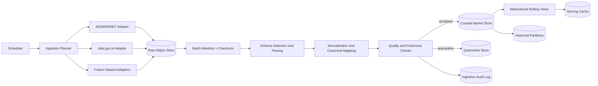
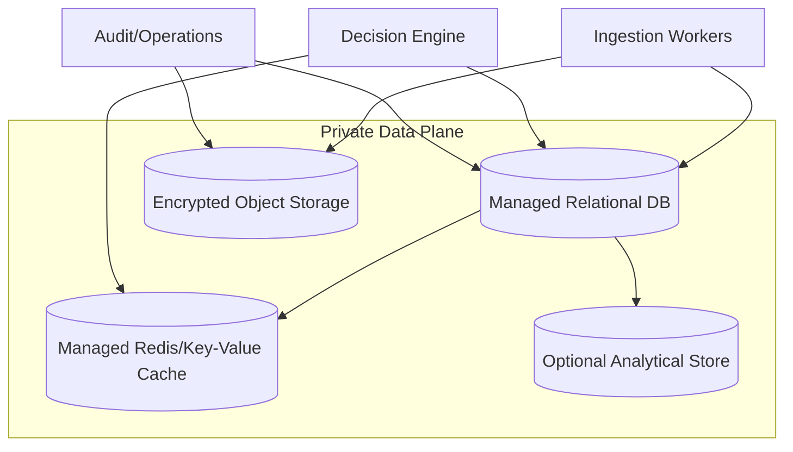
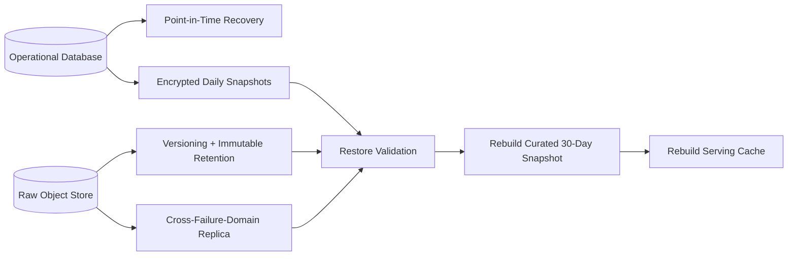

# Ermozhi — Data Layer Architecture

**Status:** Proposed production data architecture  
**Scope:** AGMARKNET, data.gov.in, and future agricultural datasets  
**Baseline:** `overView/ARCHITECTURE_REVIEW.md` and `overView/PRODUCTION_ARCHITECTURE_REDESIGN.md`

This document defines the Data Layer for production deployment. It is architecture documentation only; it contains no implementation code.

## 1. Data-layer objectives

The Data Layer must provide a trustworthy, low-latency market reference without making every farmer request depend on a live government API call. It must preserve raw source evidence, expose only normalized and quality-checked records to the Decision Engine, and make every recommendation reproducible.

The design separates ingestion, raw evidence, curated market data, serving data, and historical data.

## 2. Sources and source roles

| Source | Role | Expected handling | Authority rule |
|---|---|---|---|
| AGMARKNET API | Market-arrival and price source | Ingest through a source adapter; retain raw response and source timestamps | Preferred where configured market/commodity/variety coverage and quality checks pass |
| data.gov.in API | Government API access path for agricultural market records | Ingest through a separate adapter; normalize its resource schema and pagination | Use as primary or reconciliation source according to source policy; do not double-count overlap |
| Future agricultural datasets | Weather, crop metadata, soil, arrivals, grades, advisories, and other approved datasets | Add an adapter and dataset contract; land raw data before normalization | Each dataset declares owner, freshness, units, geography, licensing, and allowed decision use |

AGMARKNET and data.gov.in may expose overlapping observations. Deduplicate using provider IDs where available and a deterministic composite fingerprint otherwise. Never merge records merely because values look similar; provenance remains attached to every observation.

## 3. Ingestion architecture

### 3.1 Ingestion stages

1. Schedule a source-specific job for a bounded geography, commodity, date range, and page/window.
2. Read source configuration, quota budget, last successful cursor, and backfill requirement.
3. Fetch using strict timeouts, bounded pagination, retry/backoff, and provider-specific authentication.
4. Land the exact response, request parameters without secrets, retrieval timestamp, checksum, and source metadata in immutable object storage.
5. Validate the response against a versioned source schema; retain unknown columns in raw storage.
6. Normalize field names, dates, currencies, units, geography, commodity codes, varieties, grades, and price fields.
7. Deduplicate by provider ID or documented source fingerprint.
8. Validate ranges, dates, geography, units, duplicate rate, row count, and freshness.
9. Atomically publish accepted data to curated tables and refresh rolling views.
10. Record batch status, source version, counts, rejected reasons, latency, and freshness outcome.

### 3.2 Ingestion failure behavior

- A failed fetch does not erase the last good snapshot.
- A schema-breaking response lands in raw storage and quarantine; it does not reach the Decision Engine.
- A partial page failure leaves the previous curated version active and marks the batch incomplete.
- A successful empty response is a quality event, not automatically “no market data.”
- Source outage opens an alert and permits a quality-approved cached snapshot subject to freshness policy.
- Backfills are separate jobs and cannot starve current-data ingestion.

## 4. Storage architecture

### 4.1 Storage tiers

| Tier | Contents | Mutability | Purpose |
|---|---|---|---|
| Raw archive | Exact API responses, CSV files, manifests, checksums | Append-only/immutable | Replay, audit, reprocessing |
| Curated operational store | Normalized observations, dimensions, batches, freshness, quality | Append-only observations; controlled dimension corrections | Decision lookups and audit joins |
| Rolling serving views | Latest 30 days and precomputed aggregates | Rebuilt/published atomically | Fast interactive reads |
| Cache | Hot 7-day/30-day aggregates, mappings, freshness status | Ephemeral, TTL-based | Reduce repeated reads |
| Analytical store | Long-term history, quality trends, future model features | Append-only/partitioned | Analytics, not synchronous decisions |

The relational store is the normalized operational system of record. Object storage is the raw evidence system of record. Cache loss must never cause data loss or silent incorrect fallback.

## 5. Rolling 30-day storage strategy

The rolling window is a serving optimization, not the only copy of the data.

Maintain a 30-day serving window keyed by:

`source policy + state + district + market + commodity + variety + grade + unit + observation date`

Each observation retains canonical min/max/modal prices, currency/unit, arrival date, source retrieval time, source reference, batch ID, quality status, and correction/supersession state.

### Publication process

1. Land the newest source batch into staging.
2. Validate and deduplicate it.
3. Recompute affected 30-day partitions, including late/corrected observations.
4. Build a new snapshot/version of affected aggregates.
5. Atomically switch the serving pointer.
6. Invalidate only affected cache keys.
7. Retain the previous snapshot for operational rollback.

Thirty days supports seven-day decision references, short-term volatility, freshness checks, and late corrections. It must not discard older evidence.

## 6. Historical storage strategy

Historical storage is append-only and partitioned by observation date and, at scale, by source/dataset. It contains accepted records plus quality metadata.

### Historical classes

- **Raw history:** exact source payloads and source files, partitioned by source and retrieval date.
- **Canonical history:** normalized observations with lineage and correction links.
- **Quality history:** rejected rows, validation rules, schema versions, and batch outcomes.
- **Decision evidence history:** snapshot and observation references used by recommendations.
- **Analytical history:** denormalized extracts for reporting and future models.

Never overwrite an observation used by a prior decision. Ingest corrections as a new version with a supersedes reference. Rebuilding current aggregates must not change historical decision records.

Every future agricultural dataset must register its owner, license, geography, time semantics, schema/unit version, freshness SLA, quality rules, privacy class, and whether it is advisory-only, analytics-only, or decision-approved.

## 7. Cache strategy

### What should be cached

Cache frequently read, predictably changing, safely recomputable data:

- 7-day and 30-day price aggregates for common decision keys;
- current published snapshot ID and freshness status;
- canonical crop, commodity, variety, grade, state, district, and market mappings;
- source availability and last-success metadata;
- approved policy and terminology versions;
- short-lived negative lookups for unsupported combinations.

Do not cache credentials, unvalidated AI output, raw personal data, or a decision without snapshot/policy references.

### Suggested initial TTLs

| Cache item | Suggested TTL | Invalidation |
|---|---:|---|
| Snapshot pointer | 5 minutes | Atomic snapshot publication |
| 7-day aggregate | 15 minutes | Affected new/corrected batch |
| 30-day aggregate | 30 minutes | Affected new/corrected batch |
| Dimension mapping | 6–24 hours | Mapping release/version |
| Source health/freshness | 1–5 minutes | Ingestion status update |
| Negative lookup | 5 minutes | New dimension/data publication |

Cache values include snapshot ID, computed time, validity time, and freshness status. A miss reads the serving database, never the external APIs. Cache stampede protection permits one refresh per key. Cache failure degrades latency, not correctness.

## 8. Update frequency

| Job | Frequency | Purpose |
|---|---:|---|
| Freshness poll during market hours | Every 30–60 minutes | Capture new arrivals where supported |
| Off-hours poll | Every 4–6 hours | Detect late postings and maintain health |
| Daily reconciliation | Once daily after expected publication | Catch corrections and late arrivals |
| Seven-day repair/backfill | Daily | Rebuild affected recent dates |
| Rolling-window rebuild | Daily and after corrections | Publish the 30-day snapshot |
| Partition maintenance | Daily/weekly | Optimize history and analytical reads |
| Full historical reconciliation | Weekly/monthly | Detect source drift |
| Mapping/policy release | On approved change | Versioned dimension/policy publication |

Schedules must be source-aware. Polling a once-daily source every few minutes only adds cost and load.

## 9. Live versus cached data

### User request path: cached/serving data

The Decision Engine never calls AGMARKNET or data.gov.in during a farmer request. It reads a published snapshot from cache or the serving database. This makes latency predictable and isolates WhatsApp responses from source outages.

### Ingestion path: external API fetches

Only scheduled ingestion workers own source credentials, pagination, retries, and raw capture. Live retrieval is limited to operator-triggered bounded re-syncs, freshness repair jobs, and backfills, all of which must pass the normal validation and publication process first.

## 10. Minimizing API cost and provider load

1. Batch by geography, commodity, date range, and other supported filters.
2. Store cursors/watermarks and request only new or changed windows.
3. Coalesce overlapping scheduler jobs.
4. Use conditional retrieval markers where supported.
5. Re-fetch a recent correction window daily; reconcile deep history less often.
6. Share cached aggregates across farmer requests.
7. Never let user retries trigger source API retries.
8. Respect source quotas with budgets, concurrency limits, and jittered backoff.
9. Retain raw responses so normalization can be re-run without downloading again.
10. Apply server-side filters before pagination.

## 11. Reducing latency

- Precompute exact decision dimensions.
- Keep the 30-day serving view small and indexed by region, commodity, variety, grade, and date.
- Cache seven-day aggregates and the snapshot pointer.
- Use one Data Layer lookup that returns prices, evidence, freshness, and quality status.
- Avoid pandas/large CSV parsing in the interactive path.
- Publish immutable snapshots so reads do not wait for rebuild locks.
- Use connection pooling and bounded query results.
- Separate ingestion/analytics capacity from interactive reads.

Target initial behavior: cache hits in single-digit to low-tens milliseconds; serving-database lookups within a bounded low-hundreds-of-milliseconds budget, validated under pilot load.

## 12. Schema design

This is a logical schema. Physical types, indexes, and partition syntax are deployment decisions.

### 12.1 Source and ingestion metadata

| Entity | Key fields | Purpose |
|---|---|---|
| `data_source` | source ID, name, adapter, owner, active flag | Registered source and operating policy |
| `source_resource` | resource ID, source ID, resource/version, schema version, coverage, license | Specific API resource/dataset |
| `ingestion_job` | job ID, source/resource, window, scheduled/started/completed times, status, attempt | Execution record |
| `ingestion_batch` | batch ID, job ID, retrieval time, watermark, checksum, row counts, quality status | Immutable publication unit |
| `raw_object` | raw object ID, batch ID, object key, type, size, checksum, retention deadline | Exact raw payload pointer |
| `quality_issue` | issue ID, batch/row reference, rule code, severity, details | Quarantine and quality history |

### 12.2 Canonical dimensions

| Entity | Key fields | Purpose |
|---|---|---|
| `geography` | geography ID, type, state, district, canonical name, effective dates | Stable region identity |
| `market` | market ID, geography ID, source aliases, canonical name | Market/APMC identity |
| `commodity` | commodity ID, canonical name, source codes, unit policy | Crop identity |
| `variety` | variety ID, commodity ID, canonical name, aliases, grade policy | Finger/Bulb and future varieties |
| `grade` | grade ID, commodity/variety scope, canonical name, aliases | Quality comparability |
| `unit` | unit ID, quantity/price unit, conversion policy | Prevents unit errors |
| `alias_mapping` | alias, dimension type, canonical ID, language, version | Source and Tamil/English normalization |

### 12.3 Market observations

Required logical fields:

- Identity: observation ID, source ID, source record ID/fingerprint, batch ID.
- Dimensions: commodity, variety, grade, market, geography, unit.
- Time: arrival/observation date, source publication time, retrieval time.
- Values: min, max, modal price, currency, unit, and normalized values where required.
- Status: quality status, provisional/corrected flag, supersedes observation ID.
- Provenance: raw object reference, source resource, source fields, checksum.

### 12.4 Serving snapshot and aggregate

Each aggregate contains snapshot ID, dimension key, window start/end, observation count, distinct date count, latest observed/retrieved timestamps, median/mean/min/max modal prices, volatility metric if approved, quality/freshness status, and references to contributing observations.

The Decision Engine requests a snapshot by canonical dimensions and receives aggregates plus evidence references. It must not default an unknown variety to Finger.

### 12.5 Policy and audit

Store source precedence/freshness rules, decision policy versions, published snapshot pointers, decision evidence references, and data access audits. Policy versions include thresholds, aggregation method, effective time, approver, and status.

## 13. Data quality and freshness states

Validate required fields, dates, prices, min ≤ modal ≤ max, mappings, units, duplicate rate, expected coverage, watermark progression, and source schema compatibility.

Expose explicit states:

- **FRESH:** within source/application freshness SLA.
- **STALE:** last good snapshot is usable but outside the normal target; disclose it.
- **INSUFFICIENT:** not enough comparable observations.
- **UNAVAILABLE:** no quality-approved data; do not invent a recommendation.

## 14. Backup and disaster recovery

Backup requirements:

- Managed database point-in-time recovery plus daily encrypted snapshots.
- Versioned, encrypted raw payloads/manifests with immutable backup copies where required.
- Replication to a separate failure domain according to the approved RPO.
- Cache configuration/backfill metadata backed up; cache contents remain rebuildable.
- Policy versions, mappings, and source configuration exported as versioned deployment artifacts.

Restore sequence:

1. Restore the operational database to the latest valid point.
2. Restore or remount raw object history.
3. Reconcile batches after the restore point.
4. Rebuild the 30-day view and cache from canonical history.
5. Verify snapshot IDs, freshness, checksums, and sample decisions against audit records.
6. Re-enable interactive reads only after quality checks pass.

Recommended initial targets: operational RPO ≤ 5 minutes, raw evidence RPO ≤ 15 minutes or the last completed batch, Data Layer RTO ≤ 60 minutes. Perform restore drills quarterly and after major storage/schema changes.

## 15. Security and access boundaries

- Only source adapters access AGMARKNET/data.gov.in credentials.
- Only the Data Layer accesses curated tables and raw objects.
- Decision workers receive read-only filtered serving data plus evidence references.
- Operators use audited, time-limited repair/replay access.
- Secrets live in a managed secret store and never in raw payloads, cache values, or logs.
- Raw objects are private; downloads use short-lived signed access under service identity.
- Exports require purpose, scope, approval, and audit logging.

## 16. Boundary for the existing codebase

The current `src/market_data_layer.py` combines external fetching, CSV fallback, parsing, filtering, and serving logic in the request path. The production boundary should separate:

1. Source adapters for AGMARKNET and data.gov.in.
2. Landing/ingestion for raw capture, manifests, retries, and watermarks.
3. Normalization/quality for dimensions, deduplication, validation, and quarantine.
4. Serving repository for snapshot-based 30-day and seven-day reads.
5. Cache repository for hot aggregates and freshness pointers.
6. A decision-facing read returning comparable prices, freshness, provenance, and quality status.

The bundled CSV remains a development fixture and emergency seed only when it has an explicit dataset version, freshness date, and source provenance.

## Final recommendation

Fetch external market data on a controlled schedule, land every response immutably, normalize it into a versioned canonical store, publish atomic 30-day snapshots, and cache only validated aggregates. Keep the farmer request path entirely on cache/serving storage. Preserve historical observations and source evidence so decisions remain auditable and future agricultural datasets can be added without changing the Decision Engine contract.

