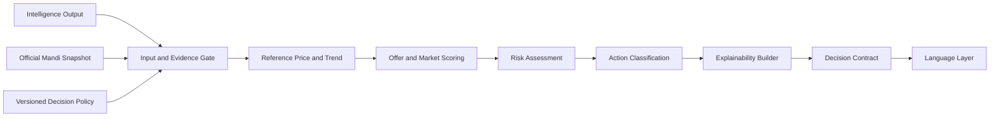
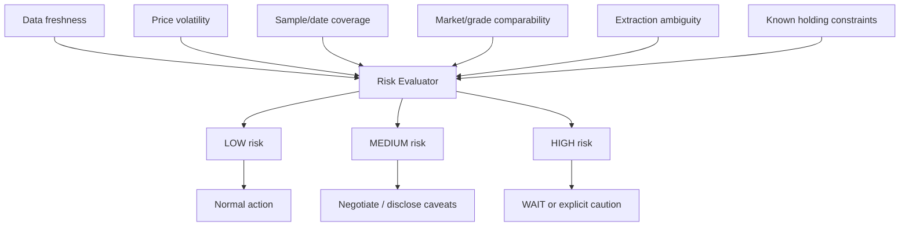

# Ermozhi — Decision Engine Architecture

**Status:** Proposed production design  
**Purpose:** Compare a farmer-reported trader offer with official mandi evidence and return an explainable action  
**Baseline:** Existing `src/decision_engine_layer.py`, `overView/DATA_LAYER_ARCHITECTURE.md`, and `overView/PRODUCTION_ARCHITECTURE_REDESIGN.md`

This document is architecture and decision-policy documentation only. It does not contain implementation code.

## 1. Decision Engine boundary

The Decision Engine is deterministic business logic. It does not call an LLM, fetch government APIs directly, or generate natural-language advice. It accepts validated Intelligence output plus a versioned Data Layer snapshot and returns a structured action, evidence, confidence, risk, and reason codes.



## 2. Inputs

```text
DecisionInput {
  request_id,
  crop: canonical ID,
  variety: canonical ID,
  district: canonical ID,
  market: optional canonical ID,
  offered_price: { value, currency, unit },
  quantity: optional { value, unit },
  historical_data: {
    snapshot_id,
    observations: [{ date, modal_price, min_price, max_price, market, source }],
    aggregates: { median, mean, min, max, volatility, trend },
    observation_count,
    distinct_date_count,
    observed_at,
    retrieved_at,
    freshness_status,
    quality_status
  },
  extraction_confidence,
  policy_version,
  engine_version
}
```

Required for a price decision: crop, variety, district, positive offered price with a comparable unit/currency, and a quality-approved market snapshot. Quantity is not required for classification but supports impact and risk explanations.

## 3. Reference-price construction

The reference is a policy-controlled statistic, not an arbitrary latest row.

1. Filter observations to the same crop, variety, district/market scope, grade policy, currency, and unit.
2. Exclude rejected, superseded, and quality-failed records.
3. Prefer the configured official market scope; do not silently mix incomparable markets.
4. Use the median modal price as the default reference because it is less sensitive to outliers.
5. Retain min/max and interquartile/spread information for risk and explainability.
6. Compute trend from dated observations only when there are enough distinct dates.
7. Mark the result insufficient when date coverage, sample count, freshness, or comparability is below policy.

The seven-day view may support the current MVP, but the production contract must carry explicit observation dates and distinguish seven records from seven distinct days.

## 4. Decision rules

Decision thresholds are configuration, versioned, approved, and effective-dated. The following is a baseline policy to be validated with domain experts and pilot data.

Let:

`offer_ratio = offered_price / reference_price`

### 4.1 Evidence gate

Return **WAIT** when any of the following is true:

- no comparable official snapshot exists;
- data is unavailable or beyond the maximum allowed freshness;
- fewer than the minimum number of distinct observation dates;
- crop, variety, district, grade, unit, or currency is ambiguous;
- the offer cannot be normalized to the snapshot unit;
- extraction confidence is below the required threshold;
- market records contain unresolved quality or source conflicts.

WAIT means “do not make this decision from current evidence; obtain clarification or the next verified update.” It is not a claim that prices will rise.

### 4.2 Offer and market action policy

| Condition | Default action | Interpretation |
|---|---|---|
| `offer_ratio >= 0.98`, fresh/stable evidence, low risk | **SELL** | Offer is at or near the official reference |
| `0.90 <= offer_ratio < 0.98`, comparable evidence | **NEGOTIATE** | Ask for a better price using the reference as evidence |
| `offer_ratio < 0.90`, evidence fresh, holding risk acceptable | **HOLD** | Do not accept this offer without another negotiation/offer |
| Any evidence gate failure or severe volatility | **WAIT** | Clarify, refresh, or obtain comparable data first |

The thresholds are not financial guarantees. The Language Layer must state that the recommendation is based on official observed mandi prices and does not account for every farm-gate cost or individual urgency.

### 4.3 Hold versus wait

- **HOLD:** the offer is materially below a trustworthy reference and the system has enough evidence to advise rejecting/deferring the current offer.
- **WAIT:** the system cannot safely compare the offer yet, or market instability/freshness makes a directional action unreliable.

If storage cost, perishability, debt pressure, transport, or urgency is known and materially changes the action, the policy may downgrade HOLD to WAIT or NEGOTIATE. If those factors are unknown, expose the limitation rather than guessing.

## 5. Scoring mechanism

The action is threshold-based; the score supports prioritization, confidence, and explanation. It must not override hard evidence gates.

### 5.1 Offer score

Normalize offer value to the reference unit and calculate a bounded offer score:

| Offer ratio | Score band |
|---:|---:|
| `>= 1.00` | 90–100 |
| `0.98–<1.00` | 80–89 |
| `0.90–<0.98` | 55–79 |
| `0.75–<0.90` | 25–54 |
| `<0.75` | 0–24 |

The exact interpolation belongs to the policy version. The score is relative to the observed official reference, not a prediction of future price.

### 5.2 Evidence score

Calculate an evidence score from independently measured factors:

- freshness of the snapshot;
- number of distinct observation dates;
- source/market comparability;
- completeness of min/modal/max and metadata;
- consistency between source records;
- extraction confidence for crop, variety, location, and price.

### 5.3 Risk-adjusted action score

```text
decision_score = 0.60 * offer_score + 0.40 * evidence_score
```

This score is informational and bounded to 0–100. A hard evidence failure still produces WAIT regardless of score. Policy may also cap confidence when volatility or sample size is poor.

## 6. Confidence calculation

Confidence expresses confidence in the comparison, not certainty that the farmer should sell.

Recommended components:

| Component | Weight | Measurement |
|---|---:|---|
| Data freshness | 20% | Age against source/application freshness SLA |
| Sample coverage | 20% | Distinct dates and number of usable observations |
| Comparability | 20% | Exact crop/variety/district/market/grade/unit match |
| Market stability | 20% | Volatility/spread relative to configured bands |
| Extraction quality | 20% | Field confidence and deterministic agreement |

`confidence = weighted component score`, capped by hard conditions.

Confidence caps:

- one or fewer distinct dates: maximum 50%;
- stale snapshot: maximum 65%;
- high volatility: maximum 70%;
- unresolved market/variety mismatch: no action confidence; return WAIT;
- low offered-price extraction confidence: no action confidence; return clarification/WAIT.

Expose a numeric score plus a plain-language band: `HIGH`, `MEDIUM`, or `LOW`. Do not present confidence as a probability of profit.

## 7. Risk assessment

Risk describes how much caution is needed before acting on the comparison.



### Risk factors

- **Freshness risk:** source observation is old relative to market update cadence.
- **Volatility risk:** recent modal prices have a wide spread or unstable direction.
- **Coverage risk:** too few distinct dates, markets, or grades.
- **Comparability risk:** farm-gate offer and official record may differ by grade, market, unit, or transaction stage.
- **Extraction risk:** voice/text interpretation is uncertain or contradictory.
- **Decision-context risk:** storage cost, urgency, transport, or quantity is unknown.

Risk levels:

- **LOW:** strong evidence, low volatility, and clear extraction.
- **MEDIUM:** usable evidence with one meaningful caveat; prefer NEGOTIATE and disclose it.
- **HIGH:** multiple caveats, stale/volatile data, or contextual uncertainty; return WAIT or a cautious non-directional response.

## 8. Explainability system

The engine returns structured reason codes and evidence references. The Language Layer converts them into Tamil/English wording.

```text
DecisionExplanation {
  action,
  headline_code,
  reason_codes: [
    OFFER_AT_OR_ABOVE_REFERENCE,
    OFFER_BELOW_REFERENCE,
    MARKET_DATA_STALE,
    HIGH_VOLATILITY,
    LIMITED_DATE_COVERAGE,
    VARIETY_MISMATCH_RISK,
    EXTRACTION_UNCERTAIN,
    HOLDING_CONTEXT_UNKNOWN
  ],
  facts: [
    offered_price,
    reference_price,
    offer_ratio,
    difference_percent,
    observation_count,
    distinct_date_count,
    latest_observed_at,
    freshness_status,
    volatility_band
  ],
  evidence_refs: [snapshot_id, observation_ids],
  policy_version,
  engine_version,
  limitations,
  generated_at
}
```

Every explanation should answer:

1. What price was offered?
2. What official reference was used?
3. How far apart are they?
4. What action was selected?
5. How fresh and comparable is the evidence?
6. What important limitation remains?

Never generate an explanation that cites a source or calculation absent from the structured result.

## 9. Output contract

```text
DecisionOutput {
  decision_id,
  action: "SELL" | "HOLD" | "WAIT" | "NEGOTIATE",
  offer: { value, currency, unit },
  reference: { value, currency, unit, aggregation_method },
  offer_ratio,
  difference_percent,
  score: { offer_score, evidence_score, decision_score },
  confidence: { value, band, caps_applied },
  risk: { level, factors, unknowns },
  explanation: DecisionExplanation,
  evidence: { snapshot_id, source_refs, observed_window },
  policy_version,
  engine_version,
  created_at
}
```

For `WAIT`, the output includes `wait_reason`, required clarification fields, or the next refresh condition. For insufficient evidence, `reference` and `offer_ratio` may be null rather than fabricated.

## 10. Current-to-target mapping

The current implementation calculates a seven-value median and returns `Fair Price`, `Negotiate`, or `Too Low`. The production mapping is:

| Current result | Target action | Required improvement |
|---|---|---|
| Fair Price | SELL | Add evidence freshness, risk, and explicit policy version |
| Negotiate | NEGOTIATE | Keep the comparison and add structured reason/evidence |
| Too Low | HOLD | Confirm data quality and holding-context limitations |
| Missing/invalid market data | WAIT | Replace implicit errors/fallbacks with explicit insufficient evidence |

The current threshold values and the earlier product documents differ. One approved policy version must become the source of truth before production decisions are enabled.

## 11. Failure and safety behavior

- Missing or ambiguous required input: do not decide; return clarification/WAIT.
- Missing or stale market evidence: do not call external APIs from the engine; return WAIT with freshness reason.
- Unit mismatch: reject or require normalization; never compare raw numbers.
- Variety/market mismatch: return WAIT, never default silently to another variety.
- Extreme/outlier data: use quality policy and robust aggregation; retain rejected evidence.
- Engine exception: persist the input/event, return a safe technical fallback, and make the job replayable.

## 12. Evaluation and governance

Maintain a versioned test set covering high/fair/low offers, volatile markets, missing days, multiple markets, grade differences, Tamil/English extraction uncertainty, and stale sources.

Measure:

- classification consistency and boundary behavior;
- false confidence and WAIT appropriateness;
- evidence freshness/comparability violations;
- explanation factuality against stored evidence;
- replay determinism;
- outcome feedback from the pilot without treating outcomes as proof of price causality.

Changes to thresholds, reference method, confidence weights, or action semantics require policy approval, versioning, and an evaluation report.

## Final recommendation

Keep the engine deterministic, evidence-bound, and conservative under uncertainty. Use `SELL`, `NEGOTIATE`, `HOLD`, and `WAIT` as explicit actions; use scoring to explain strength of evidence, not to override safety gates; and return enough provenance for the farmer, operator, and auditor to understand exactly how the action was derived.

