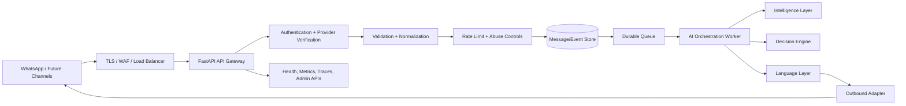
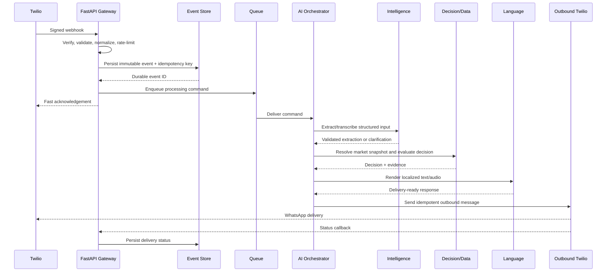
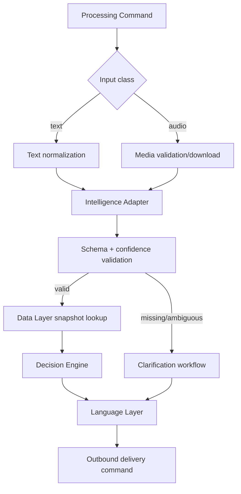

# Ermozhi — FastAPI API Gateway Architecture

**Status:** Proposed production gateway architecture  
**Scope:** Public channel ingress, internal request routing, security, AI orchestration, and operational controls  
**Baseline:** Existing `src/app.py`, `src/main.py`, `overView/ARCHITECTURE_REVIEW.md`, and `overView/PRODUCTION_ARCHITECTURE_REDESIGN.md`

This document is architecture and documentation only. It does not define implementation code.

## 1. Gateway purpose

The FastAPI API Gateway is the controlled entry point into Ermozhi. It translates channel-specific requests into canonical messages, authenticates the caller, validates payloads, applies rate limits, persists an accepted event, and coordinates asynchronous processing.

The gateway must not perform long-running Gemini, media, market-data, or TTS work inside the provider webhook request. It should acknowledge a durable event quickly and let private workers perform the AI workflow.



## 2. Responsibilities

### Authentication and trust

- Verify Twilio HMAC signatures for WhatsApp webhooks using the externally visible HTTPS URL and original form parameters.
- Authenticate private service-to-service requests using workload identity, mTLS, or signed service tokens.
- Authenticate operator APIs through the organization identity provider with role-based access.
- Never treat `From`, phone numbers, or arbitrary headers as trusted identity claims.

### Request routing

- Route versioned public paths to channel adapters and internal paths to bounded service contracts.
- Keep provider-specific payload translation at the edge.
- Route asynchronous work to the correct queue and worker class.
- Route delivery callbacks and status events separately from inbound user messages.

### Validation

- Enforce content type, body size, media count, allowed media types, required provider fields, timestamp/replay rules, and schema version.
- Normalize `From`, message IDs, locale hints, media metadata, and correlation identifiers.
- Reject malformed requests before persistence or AI processing.
- Return structured validation errors without leaking secrets or raw provider payloads.

### Logging and monitoring

- Assign and propagate `request_id`, `message_id`, `conversation_id`, `correlation_id`, and provider event ID.
- Emit structured logs with redaction and consistent severity.
- Publish metrics for traffic, latency, authentication failures, validation failures, rate limits, queueing, retries, and downstream status.
- Emit distributed traces across gateway, queue, workers, and outbound delivery.

### Rate limiting

- Apply global, channel, participant, IP, provider-account, and endpoint-specific limits.
- Separate abuse protection from legitimate harvest-time bursts.
- Rate-limit expensive internal operations and operator replay APIs more aggressively.
- Return `429` with a bounded retry hint and never spin on provider callbacks.

### AI orchestration

- Persist a canonical message before enqueueing processing.
- Select the workflow based on input type, locale, intent, and processing policy.
- Coordinate Intelligence, Data, Decision, Language, and outbound delivery stages.
- Enforce stage deadlines, idempotency, retry classes, and circuit breakers.
- Store model, prompt/schema, policy, market snapshot, and response versions for replay.
- Do not allow model output to bypass schema validation or invoke arbitrary tools.

## 3. API endpoint structure

The public gateway is versioned from the start. `/webhook` may remain temporarily as a compatibility alias, but new integrations use `/api/v1` paths.

### 3.1 Public channel endpoints

| Method | Endpoint | Purpose | Caller | Response |
|---|---|---|---|---|
| `POST` | `/api/v1/channels/whatsapp/webhook` | Receive Twilio inbound messages | Twilio | Fast `200` TwiML acknowledgement or `403`/`4xx` rejection |
| `POST` | `/api/v1/channels/whatsapp/status` | Receive delivery/status callbacks | Twilio | Fast `204` or `200` |
| `GET` | `/api/v1/health/live` | Process liveness | Platform | `200` if process is alive |
| `GET` | `/api/v1/health/ready` | Dependency/readiness status | Platform | `200` only if safe to accept events |
| `GET` | `/api/v1/metadata` | Non-sensitive service metadata | Authorized/internal | Version and capabilities |

Twilio webhook response behavior should be deliberately chosen:

- **Preferred production mode:** acknowledge receipt with minimal TwiML and send the completed response through the Twilio outbound API after workers finish.
- **Compatibility mode:** return a short synchronous TwiML response only for bounded, already-cached operations. This mode must have a hard deadline and must not call Gemini or TTS inline.

### 3.2 Internal gateway endpoints

| Method | Endpoint | Purpose | Caller |
|---|---|---|---|
| `POST` | `/internal/v1/messages` | Submit a canonical message for processing | Trusted channel adapter/worker |
| `GET` | `/internal/v1/messages/{message_id}` | Read processing status | Trusted operations/UI service |
| `POST` | `/internal/v1/messages/{message_id}/replay` | Replay a failed event | Authorized operator |
| `POST` | `/internal/v1/deliveries` | Request outbound channel delivery | Language/orchestration worker |
| `GET` | `/internal/v1/providers/status` | Read provider circuit and health state | Operations |

### 3.3 Operational endpoints

Operational routes are separate from public channel routes and require operator identity plus role authorization.

| Method | Endpoint | Purpose |
|---|---|---|
| `GET` | `/ops/v1/metrics/summary` | Aggregated operational metrics |
| `GET` | `/ops/v1/queues` | Queue age, depth, retries, dead letters |
| `POST` | `/ops/v1/circuits/{provider}/open` | Emergency provider disablement |
| `POST` | `/ops/v1/replays` | Controlled replay with reason and approval |

Do not expose raw prompts, raw audio, credentials, or unrestricted database queries through operations endpoints.

## 4. Canonical request contracts

These are logical API contracts, not implementation code.

### 4.1 Inbound channel event

```text
POST /api/v1/channels/whatsapp/webhook
Content-Type: application/x-www-form-urlencoded

Provider fields are translated into:
{
  event_id,
  provider: "twilio",
  provider_event_id,
  channel: "whatsapp",
  participant_ref,
  conversation_ref,
  input: {
    kind: "text" | "audio",
    text,
    media_ref,
    media_content_type,
    media_duration_seconds
  },
  received_at,
  locale_hint,
  correlation_id,
  schema_version
}
```

The gateway persists the canonical event and returns an acceptance response containing `event_id`, `message_id`, `correlation_id`, and processing status. The public response must not expose internal queue names or provider credentials.

### 4.2 Processing status

```text
{
  message_id,
  status: "ACCEPTED" | "PROCESSING" | "WAITING_FOR_CLARIFICATION" |
          "DELIVERED" | "FAILED" | "DEAD_LETTERED",
  correlation_id,
  accepted_at,
  updated_at,
  response_delivery_ref,
  failure_code
}
```

Status is operational metadata, not a second source of truth for the Decision Engine. The immutable event and stage records remain authoritative.

### 4.3 Internal processing command

```text
{
  message_id,
  event_id,
  conversation_ref,
  input_ref,
  workflow: "PRICE_EVALUATION" | "CLARIFICATION" | "UNSUPPORTED_INPUT",
  locale_policy,
  deadline_at,
  attempt,
  correlation_id,
  schema_version
}
```

### 4.4 Delivery request

```text
{
  delivery_id,
  message_id,
  channel: "whatsapp",
  recipient_ref,
  text,
  media_object_ref,
  reply_to_provider_message_id,
  idempotency_key,
  expires_at
}
```

## 5. Request lifecycle



### Lifecycle stages

1. **Network edge:** TLS, WAF, request-size limit, and basic connection protections.
2. **Provider authentication:** Verify Twilio signature before trusting form fields.
3. **Parsing and validation:** Parse form data, enforce allowed types, and normalize to a canonical event.
4. **Identity and deduplication:** Resolve an opaque participant reference and check provider event/message idempotency.
5. **Durability:** Persist the event and media reference before acknowledging it.
6. **Admission control:** Apply rate limits, queue limits, and workflow policy.
7. **Acknowledgement:** Return a minimal provider-compatible response quickly.
8. **Orchestration:** Enqueue and execute input, intelligence, data/decision, language, and delivery stages.
9. **Delivery:** Send text/audio through the outbound adapter with an idempotency key.
10. **Completion:** Persist final status, metrics, trace outcome, provider IDs, and evidence references.

## 6. AI orchestration design

The gateway owns orchestration policy, not model semantics.



### Orchestration rules

- A model call is never made before media and payload validation.
- A failed or low-confidence extraction cannot invoke the Decision Engine.
- Unknown variety, unit, market, or crop results in clarification or insufficient evidence; never silently defaults to a different commodity.
- The Decision Engine receives a specific market snapshot and policy version.
- The Language Layer receives structured outcomes and may not alter classification, prices, or evidence.
- AI prompts, model IDs, schema versions, and confidence thresholds are configuration records tied to each extraction.
- The orchestrator enforces a total deadline and per-stage budgets.
- All stage outputs are persisted or referenced sufficiently to replay a decision without re-calling providers.

## 7. Security model

### Public boundary

- TLS-only public ingress behind managed WAF/load balancing.
- Twilio HMAC signature validation using the canonical external URL, raw parameters, and secret from a managed secret store.
- Replay defense using provider message/event ID and a bounded timestamp policy.
- Body, media count, media size, audio duration, and content-type limits.
- No unauthenticated public access to internal status, replay, metrics, queue, or provider endpoints.

### Identity and authorization

| Caller | Authentication | Authorization |
|---|---|---|
| Twilio webhook | HMAC signature | Channel ingress only |
| Internal worker | Workload identity/mTLS/signed service token | Explicit stage operations |
| Operator | SSO/OIDC plus MFA | Role-based, audited operations |
| Monitoring probe | Network identity or signed probe token | Liveness/readiness only |

The phone number in a message is a channel identifier, not an authorization credential. Store it behind an opaque participant reference and redact it from ordinary logs.

### Service boundaries

- Gateway is the only public application service.
- Queues, databases, object storage, AI providers, and Data Layer APIs are private.
- AI output is untrusted input and must pass deterministic schema/range/unit validation.
- Media URLs are not arbitrary fetch targets; retrieval is restricted to validated Twilio media access.
- Secrets never appear in logs, traces, queue payloads, cache entries, or error responses.

## 8. Validation model

Validation is staged so cheap checks happen before expensive work:

| Stage | Checks |
|---|---|
| Transport | TLS, method, content type, body size, header limits |
| Provider | Signature, provider event ID, timestamp/replay, required fields |
| Channel | Media count, allowed media types, text length, sender format |
| Canonical request | Schema version, enum values, normalized references, idempotency |
| Workflow | Supported input class, locale, crop/feature scope, deadline |
| AI result | JSON schema, positive price, units, confidence, missing/ambiguous fields |
| Delivery | Recipient reference, text/media size, expiration, channel rules |

Validation failures should include a stable machine-readable code, safe human message, correlation ID, and retryability classification.

## 9. Error handling

### Public response policy

| Condition | HTTP behavior | User/provider behavior |
|---|---:|---|
| Valid and durably accepted | `200`/`202` depending on Twilio contract | Minimal acknowledgement; async reply follows |
| Invalid signature | `403` | Reject; do not persist/process |
| Unsupported media/type | `400` or provider-compatible `200` with clarification | Explain supported text/voice input |
| Rate limit | `429` | Retry hint; no AI work |
| Duplicate provider event | `200`/`202` | Return existing acceptance; no duplicate workflow |
| Gateway unavailable before durability | `5xx` | Provider may retry; preserve safe retry semantics |
| Internal accepted-event processing failure | No retroactive webhook failure | Queue retry/dead letter; send user-safe fallback if possible |
| Downstream provider outage | Gateway remains available | Async retry, text fallback, or status update |

For Twilio, the final HTTP/TwiML behavior must be tested against its retry semantics. The system should not return a success response claiming a completed recommendation before the event is durable.

### Error envelope for internal APIs

```text
{
  error: {
    code,
    category: "AUTHENTICATION" | "VALIDATION" | "CONFLICT" |
              "RATE_LIMIT" | "DEPENDENCY" | "INTERNAL",
    message,
    retryable,
    correlation_id,
    details_ref
  }
}
```

Do not expose stack traces, SQL, provider tokens, raw prompts, or raw media URLs.

## 10. Retry and recovery strategy

### Retry classes

- **No retry:** invalid signature, malformed payload, unsupported media, authorization failure, policy rejection, invalid AI schema.
- **Bounded retry:** network timeout, connection reset, provider 429/5xx, transient database/queue failure.
- **Delayed retry:** provider outage, TTS outage, or market snapshot temporarily unavailable.
- **Manual replay:** dead-lettered events after an operator confirms root cause and data/policy safety.

### Retry controls

- Exponential backoff with jitter and a maximum elapsed deadline.
- Per-provider circuit breakers and concurrency budgets.
- Queue visibility timeout longer than the stage deadline, with lease extension only while work is healthy.
- Maximum attempts per stage and a dead-letter queue.
- Idempotent writes and outbound delivery keys on every retry.
- Persist attempt number, error category, provider request ID, and next retry time.
- Never retry the entire workflow when only TTS failed; deliver text-only and retry audio independently.

### Failure matrix

| Failure | Gateway action | Orchestrator action | Final behavior |
|---|---|---|---|
| Twilio signature mismatch | Reject immediately | None | `403`, security metric |
| Duplicate webhook | Return existing event | No new command | One logical response |
| Media fetch timeout | Accept only if event is durable | Retry media stage | Clarification/failure after limit |
| AI timeout/rate limit | No synchronous retry in webhook | Retry with circuit breaker/model policy | Clarify or safe failure after limit |
| AI low confidence | Persist extraction outcome | Skip decision | Targeted clarification |
| Data snapshot stale | Keep gateway available | Apply freshness policy | Disclose stale data or insufficient evidence |
| Decision failure | Keep event durable | Replay deterministic stage | Dead letter after limit |
| TTS failure | Do not roll back decision | Send text-only; retry audio separately | Text response |
| Twilio outbound failure | Persist delivery attempt | Retry only transient errors | Dead letter permanent failures |
| Database unavailable | Readiness fails; stop accepting undurable events | Do not acknowledge new work | Provider retry after recovery |

## 11. Rate limiting and abuse prevention

Recommended logical limits:

- Per IP at the edge for malformed/unauthenticated traffic.
- Per Twilio account/source identity for webhook flood protection.
- Per participant/conversation for farmer-level fairness and abuse control.
- Global concurrent media downloads, AI calls, TTS calls, and outbound sends.
- Separate quotas for operator replay and administrative APIs.

Rate-limit keys should be opaque and privacy-preserving. Limits must be observable, configurable, and fail closed for unauthenticated abuse traffic. When the limiter is unavailable, choose a documented fail-open/fail-closed policy per endpoint; security-sensitive endpoints should fail closed.

## 12. Logging, monitoring, and observability

### Structured log fields

`timestamp`, `level`, `service`, `environment`, `request_id`, `correlation_id`, `message_id`, `conversation_id`, `provider_event_id`, `route`, `status_code`, `latency_ms`, `attempt`, `error_code`, and `dependency`.

Never log full phone numbers, auth headers, API keys, raw audio, raw prompts, or unredacted provider payloads.

### Required metrics

- Requests by route, channel, status, and authentication result.
- Validation and rate-limit rejection counts.
- Duplicate-event suppression count.
- Acceptance latency and durable-write failure rate.
- Queue depth, age, retries, dead letters, and processing latency by stage.
- AI calls, latency, cost, model fallback, confidence, and clarification rate.
- Data snapshot freshness and insufficient-evidence rate.
- TTS success/text-only fallback and outbound delivery status.
- End-to-end time from inbound event to farmer-visible response.

### Health checks

- **Liveness:** process/event loop is responsive; no deep dependency checks.
- **Readiness:** can durably persist events and publish to the queue; returns not-ready when accepting traffic would lose data.
- **Dependency health:** separate non-blocking provider status metrics; do not make liveness depend on Gemini/TTS availability.

## 13. API versioning

### Strategy

- Version public contracts in the URL: `/api/v1/...`.
- Version internal event schemas independently, for example `schema_version` on every event.
- Keep provider adapters isolated so Twilio payload changes do not change the canonical contract.
- Add fields compatibly; do not remove or change semantics within a major version.
- Use a new major version for breaking changes to field meaning, authentication, idempotency, or response semantics.
- Publish an OpenAPI contract and compatibility rules for each version.

### Deprecation

- Announce deprecation with dates, migration notes, and metrics for remaining callers.
- Maintain a compatibility alias such as `/webhook` only during a time-bounded migration.
- Log version usage and reject unknown future versions clearly.
- Do not silently reinterpret old events with new decision or policy semantics; replay using the original schema/policy where required.

### Version dimensions

Track separately:

- API version;
- canonical event schema version;
- AI extraction schema/prompt/model version;
- Decision Engine version;
- market snapshot version;
- language/terminology version;
- provider adapter version.

## 14. Scaling and deployment requirements

- Stateless gateway replicas behind managed HTTPS load balancing.
- Autoscale on request rate, p95 latency, durable-write latency, and connection saturation.
- Keep AI/media/TTS workers on independent queues and scaling policies.
- Use connection pooling and bounded request concurrency.
- Apply backpressure when queue depth, provider quotas, or database capacity approaches limits.
- Deploy gateway and workers independently but use compatible event schema versions.
- Use rolling/canary releases with readiness checks and rapid rollback.
- Keep secrets/configuration outside the image and support rotation without source changes.

## 15. Migration from the current FastAPI implementation

1. Make FastAPI the single public ingress and retire the optional Node forwarding path or keep it strictly internal.
2. Add strict Twilio signature verification as a required production setting.
3. Add canonical event persistence and idempotency before acknowledging requests.
4. Move Gemini, market lookup, and TTS out of the webhook handler into queue workers.
5. Add `/api/v1/channels/whatsapp/webhook` and retain `/webhook` only as a monitored compatibility alias.
6. Introduce structured logs, correlation IDs, readiness/liveness separation, metrics, and traces.
7. Add provider circuit breakers, dead-letter queues, replay controls, and outbound delivery idempotency.
8. Keep the existing deterministic Decision Engine contract, but make market snapshot and policy versions explicit inputs.

## Final recommendation

Use FastAPI as a thin, secure, versioned gateway and durable event admission point. Keep public webhook handling fast and deterministic; move AI orchestration to private asynchronous workers with explicit contracts, bounded retries, and replayable stage records. This preserves the existing WhatsApp integration while eliminating the current risks from synchronous external calls, optional authentication, duplicate processing, and opaque failures.

