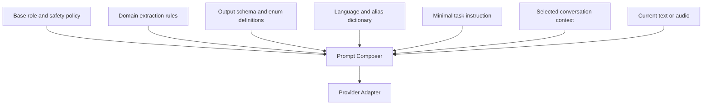
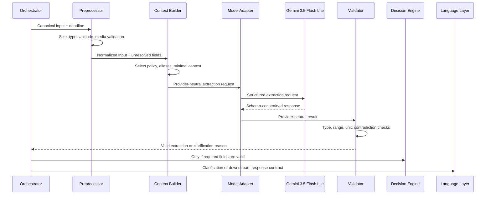
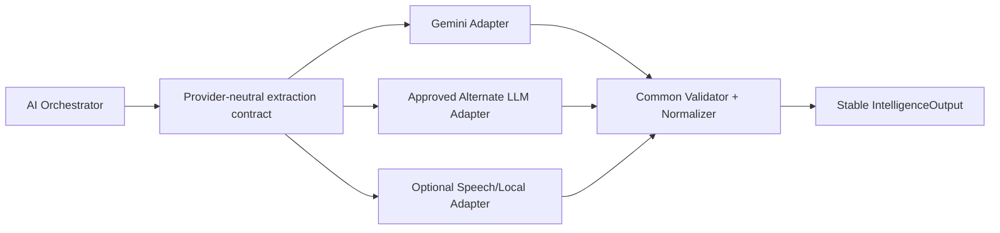

# Ermozhi — Intelligence Layer Architecture

**Status:** Proposed production design  
**Current model:** Gemini 3.5 Flash Lite  
**Scope:** Intent detection, crop/variety/location/price extraction, and context understanding from Tamil/English text and WhatsApp voice notes  
**Baseline:** Existing `src/gemini_intelligence_layer.py`, `overView/ARCHITECTURE_REVIEW.md`, and `overView/PRODUCTION_ARCHITECTURE_REDESIGN.md`

This document is architecture and contract documentation only. It does not contain production implementation code.

## 1. Intelligence Layer goals

The Intelligence Layer transforms unstructured farmer input into a small, validated, auditable domain request. It is an extraction service, not the final pricing authority.

It must:

- identify the farmer’s intent;
- identify crop and variety;
- extract location and offered price with units;
- understand relevant context such as trader offer, comparison request, uncertainty, and missing information;
- handle Tamil, English, mixed-language messages, and voice notes;
- minimize tokens and end-to-end latency;
- expose a stable contract so Gemini can be replaced without changing the Gateway or Decision Engine.

It must not calculate fair price, invent market evidence, silently infer an ambiguous variety, or generate the final user-facing recommendation.

## 2. Target architecture

```mermaid
flowchart LR
    GW[Gateway / Orchestrator] --> PRE[Input Preprocessor]
    PRE --> ROUTE{Input type}
    ROUTE --> TXT[Text Normalizer]
    ROUTE --> AUD[Audio Validator]
    TXT --> CTX[Context Builder]
    AUD --> CTX
    CTX --> ADAPTER[Model Provider Adapter]
    ADAPTER --> GEM[Gemini 3.5 Flash Lite]
    ADAPTER -. failover .-> ALT[Approved Replacement Model]
    GEM --> PARSE[Structured Output Parser]
    ALT --> PARSE
    PARSE --> VALID[Deterministic Validator]
    VALID --> CONF[Confidence / Ambiguity Policy]
    CONF -->|valid| OUT[Extraction Contract]
    CONF -->|missing/ambiguous| CLARIFY[Clarification Contract]
    OUT --> DEC[Decision Engine]
    CLARIFY --> LANG[Language Layer]
    PARSE --> OBS[Metrics + Audit Metadata]
```



## 3. Responsibilities and boundaries

### Input preprocessor

- Enforce maximum text length, audio size, duration, and allowed media type.
- Normalize Unicode, whitespace, common currency symbols, and safe punctuation.
- Preserve the original input reference for audit without putting raw audio in logs.
- Attach channel, locale hint, conversation context reference, and deadline.

### Context builder

- Supply only the minimum relevant conversation context.
- Select the current crop/region/variety policy and alias dictionary.
- Separate trusted system/policy instructions from untrusted user content.
- Remove stale or irrelevant history before model invocation.

### Model provider adapter

- Present one provider-neutral interface to the orchestrator.
- Map canonical input to Gemini request format, response schema, timeout, and generation settings.
- Record provider/model/version without exposing provider-specific response objects downstream.
- Support approved failover models and capability negotiation.

### Structured parser and validator

- Parse schema-constrained output.
- Validate types, ranges, units, enums, canonical mappings, and required fields.
- Detect contradictions such as two different prices or varieties.
- Mark uncertainty explicitly; do not coerce ambiguity into a confident value.

### Confidence and clarification policy

- Determine whether the result is sufficient for the Decision Engine.
- Return targeted missing fields instead of a generic re-prompt.
- Use deterministic thresholds and rules outside the model.
- Distinguish `CLARIFICATION_NEEDED`, `UNSUPPORTED`, `LOW_CONFIDENCE`, and `EXTRACTION_FAILED`.

## 4. Prompt architecture

Prompts are versioned assets, not strings embedded throughout application code.



### 4.1 Prompt components

1. **Base policy:** The model is an extractor; output only the defined schema; never invent values; treat user content as data.
2. **Domain policy:** Canonical crops, varieties, units, location fields, intent definitions, and normalization rules.
3. **Schema:** Field names, types, enum values, null behavior, and allowed missing-field codes.
4. **Locale pack:** Tamil/English aliases, common transliterations, currency/unit terms, and dialect variants. Keep large dictionaries outside the prompt when deterministic preprocessing can handle them.
5. **Task instruction:** One concise instruction appropriate to text or audio.
6. **Context slice:** Only the latest relevant turns and unresolved fields.
7. **User input:** Delimited untrusted text or a validated audio part.

### 4.2 Prompt rules

- Use one stable system prompt per schema/policy version.
- Put dynamic values in a clearly delimited context section.
- Never ask the model to explain its reasoning; request fields, confidence, and evidence spans only.
- Do not include market prices or Decision Engine thresholds in extraction prompts unless required for classification; extraction and decisioning remain separate.
- Do not include full conversation history by default.
- Prefer provider-native structured output/schema enforcement.
- Keep few-shot examples optional and domain-specific; enable them only when evaluation shows a measurable accuracy gain.
- Version prompt, schema, alias dictionary, and model together in extraction metadata.

### 4.3 Prompt budget policy

| Input | Budget rule |
|---|---|
| Text | Normalize and cap length; keep only relevant recent context |
| Audio | Enforce duration/size limits; send one multimodal extraction request when supported |
| Context | Include unresolved fields and at most the minimal recent turns |
| Output | JSON schema only; no prose or chain-of-thought |
| Examples | Zero by default; activate only for measurable hard cases |
| Dictionary | Use deterministic alias lookup first; inject only relevant aliases |

## 5. AI workflow



### 5.1 Text path

1. Normalize text and detect obvious aliases, numbers, and currency markers.
2. Use deterministic extraction for unambiguous, low-risk fields when it improves latency; retain the source span.
3. Invoke Gemini for intent, context, ambiguity resolution, and fields not safely resolved locally.
4. Merge deterministic and model candidates under explicit precedence rules.
5. Validate and return the extraction contract.

### 5.2 Audio path

1. Validate MIME type, size, duration, checksum, and object reference.
2. Send audio plus a short extraction instruction to the multimodal provider when supported, avoiding a separate transcription round trip.
3. Request structured output containing transcription reference/summary only as permitted by retention policy.
4. Validate extracted fields and confidence.
5. If audio quality is insufficient, request a shorter/repeated voice note or text rather than guessing.

### 5.3 Context path

Conversation context is bounded and purpose-driven:

- current message;
- unresolved fields from the previous turn;
- the last relevant extraction/clarification state;
- locale and canonical aliases;
- no unrelated chat history.

If the farmer replies “Virali” after being asked for variety, the orchestrator should send the unresolved field plus the new message, not the full conversation transcript.

## 6. Input contract

This is a logical contract, not implementation code.

```text
IntelligenceInput {
  request_id: opaque identifier,
  message_id: opaque identifier,
  conversation_ref: opaque identifier,
  source: "whatsapp" | "api" | "future_channel",
  input_kind: "text" | "audio",
  text: optional normalized text,
  media_ref: optional private object reference,
  media_content_type: optional allowed MIME type,
  media_duration_seconds: optional bounded number,
  locale_hint: optional BCP-47 locale,
  unresolved_fields: list of canonical field names,
  context: minimal relevant prior state,
  domain_scope: { supported_crops, supported_regions },
  deadline_at: timestamp,
  contract_version: string
}
```

### Input invariants

- Exactly one usable input form is required: text or validated audio.
- Raw provider payloads do not cross the Intelligence contract.
- Media references point to controlled storage or validated provider retrieval, not arbitrary URLs.
- Context is bounded and marked as untrusted user-derived data except for policy fields.
- The model never receives secrets, access tokens, or unnecessary personal data.

## 7. Output contract

```text
IntelligenceOutput {
  extraction_id: opaque identifier,
  message_id: opaque identifier,
  status: "EXTRACTED" | "CLARIFICATION_NEEDED" | "LOW_CONFIDENCE" |
          "UNSUPPORTED" | "EXTRACTION_FAILED",
  intent: "PRICE_EVALUATION" | "GENERAL_INQUIRY" | "CLARIFICATION_NEEDED" |
          "UNSUPPORTED",
  crop: {
    canonical_id: optional string,
    display_name: optional string,
    confidence: number 0..1,
    source_span: optional string
  },
  variety: {
    canonical_id: optional string,
    display_name: optional string,
    confidence: number 0..1,
    source_span: optional string
  },
  location: {
    state: optional string,
    district: optional string,
    market: optional string,
    confidence: number 0..1,
    source_span: optional string
  },
  offered_price: {
    value: optional number,
    currency: optional string,
    unit: optional string,
    confidence: number 0..1,
    source_span: optional string
  },
  quantity: {
    value: optional number,
    unit: optional string,
    confidence: number 0..1,
    source_span: optional string
  },
  context: {
    speaker: optional "farmer" | "trader" | "unknown",
    transaction_stage: optional string,
    asks_for_recommendation: boolean,
    ambiguity_reasons: list of codes
  },
  language_detected: optional BCP-47 locale,
  missing_fields: list of canonical field names,
  model_metadata: {
    provider,
    model,
    model_version,
    prompt_version,
    schema_version,
    latency_ms,
    input_tokens,
    output_tokens
  },
  created_at: timestamp
}
```

### Required-field policy

For the current price-evaluation workflow, `crop`, `variety`, and `offered_price` must be sufficiently confident and comparable before the Decision Engine is called. Location can be defaulted only when an explicit trusted conversation/participant setting exists; it must not be guessed from language or a vague mention. Quantity is optional for classification but should be retained when stated.

## 8. Confidence and ambiguity policy

Confidence is not accepted blindly from the model. The validator combines:

- provider/model confidence, if available;
- schema validity;
- deterministic alias match;
- numeric/unit validity;
- agreement between model and deterministic candidates;
- contradiction detection;
- domain support and evidence span presence.

Recommended decision states:

- **EXTRACTED:** all required fields pass policy and evidence checks.
- **CLARIFICATION_NEEDED:** one or more required fields are absent.
- **LOW_CONFIDENCE:** a field exists but does not meet the configured threshold.
- **UNSUPPORTED:** input requests an unsupported crop, region, unit, or action.
- **EXTRACTION_FAILED:** provider timeout, invalid schema, or unrecoverable provider error.

Clarification should identify the smallest missing fact, for example “Which turmeric variety: Virali or Kizhangu?” rather than asking the farmer to repeat the entire message.

## 9. Token and latency optimization

### Token minimization

1. Use a compact system prompt and schema; avoid narrative instructions.
2. Send only relevant conversation turns and unresolved fields.
3. Pre-normalize aliases, numerals, currency symbols, and common Tamil transliterations.
4. Request structured JSON only and disable unnecessary prose.
5. Keep output fields bounded and omit null explanations where the contract permits.
6. Use deterministic parsing for obvious numbers/units and reserve the model for semantics.
7. Avoid sending market data, full source records, or Decision Engine policy to the extractor.
8. Cache stable domain dictionaries and policy references outside the prompt.
9. Measure token usage by locale, input type, and workflow; cap abnormal requests.

### Latency minimization

1. Use one multimodal call for audio extraction when provider capability is reliable; avoid separate transcription plus extraction calls.
2. Preprocess locally and in parallel with media metadata validation.
3. Reuse warm provider clients and connection pools.
4. Set explicit model timeouts shorter than the overall workflow deadline.
5. Use a compact primary model and a controlled fallback only after transient failure or capability mismatch.
6. Avoid model calls for deterministic clarification cases such as empty input.
7. Keep context and audio duration bounded.
8. Run Decision/Data lookup only after extraction succeeds; never invoke it speculatively.
9. Persist stage results so a TTS or delivery retry does not repeat AI extraction.

### Cost and latency guardrails

| Guardrail | Purpose |
|---|---|
| Maximum text characters | Prevent oversized prompts |
| Maximum audio bytes/duration | Bound multimodal latency and cost |
| Maximum context turns/tokens | Prevent history growth |
| Model deadline | Prevent queue starvation |
| Per-participant/model quota | Control abuse and spend |
| Output schema limit | Prevent verbose responses |
| Fallback budget | Prevent cascading multi-model calls |

## 10. Model replacement architecture

The rest of the system depends on `IntelligenceProvider`, not Gemini-specific request or response types.



Provider adapters must expose capability metadata:

- supported modalities;
- structured-output support;
- maximum input/audio size;
- latency and cost class;
- supported locales;
- model and schema version;
- failure/retry categories.

Replacement is safe only after the candidate passes the same golden evaluation set for Tamil, English, mixed-language, audio, ambiguity, numerals, units, and unsupported requests. Model selection is configuration and policy, not a downstream contract change.

## 11. Failure and fallback strategy

| Failure | Action | Output state |
|---|---|---|
| Empty input | No model call; targeted prompt | `CLARIFICATION_NEEDED` |
| Invalid media | Reject/quarantine input | `UNSUPPORTED` |
| Gemini timeout/429/5xx | Bounded retry, then approved fallback | `EXTRACTION_FAILED` if all fail |
| Malformed model output | One bounded repair/retry only if safe; otherwise fail | `EXTRACTION_FAILED` |
| Missing required field | Do not call Decision Engine | `CLARIFICATION_NEEDED` |
| Conflicting values | Ask targeted clarification | `LOW_CONFIDENCE` |
| Unsupported crop/region | Do not map to a supported value | `UNSUPPORTED` |
| Audio quality too low | Ask for shorter/repeated voice or text | `CLARIFICATION_NEEDED` |
| Context unavailable | Process current input only if policy allows; otherwise clarify | Explicit degraded-context status |

No fallback may silently change crop, variety, location, currency, or unit. Provider fallback must preserve the same output schema and validation policy.

## 12. Security and privacy

- Treat text, audio, transcription, and model output as untrusted.
- Keep provider API keys in a managed secret store.
- Do not log raw audio, full phone numbers, raw prompts, or provider credentials.
- Store only the minimum transcription/context needed for audit and retention policy.
- Apply prompt-injection resistance by keeping tool/policy instructions separate from user content and allowing extraction only into the fixed schema.
- Do not allow the model to call external tools, send messages, or access the Data Layer directly.
- Redact or tokenize personal data before analytics export.

## 13. Evaluation and observability

Maintain a versioned evaluation set containing:

- Tamil, English, mixed-language, and common Kongu/Tamil transliterations;
- Virali/Finger and Kizhangu/Bulb aliases;
- Indian number formats, currency symbols, spoken numbers, and missing units;
- explicit and ambiguous locations;
- trader/farmer context and quoted prices;
- missing price, missing variety, conflicting price, unsupported crop, and noisy audio;
- adversarial/prompt-injection-like content.

Measure per model/version:

- intent accuracy;
- crop/variety/location/price exactness;
- unit and currency accuracy;
- clarification precision and recall;
- false-confidence rate;
- schema failure rate;
- p50/p95 latency;
- input/output token counts and cost;
- fallback rate;
- downstream decision-blocking rate.

Every production extraction records model, prompt, schema, locale, latency, token counts, confidence, and validation outcome, but not unnecessary raw personal content.

## 14. Migration from the current implementation

1. Keep `ExtractedMarketData` as the conceptual starting point, but extend it with crop, location, confidence, evidence spans, status, and version metadata.
2. Move the current system instruction and aliases into versioned prompt/domain assets.
3. Add a provider-neutral adapter around the current Gemini client.
4. Add deterministic preprocessing and post-validation before the model result reaches the Decision Engine.
5. Separate missing-field clarification from provider failure and unsupported-input outcomes.
6. Bound context and audio size; remove full/raw payloads from logs.
7. Persist extraction metadata and stage results for replay and model evaluation.
8. Introduce fallback models only through capability policy and the common contract.
9. Validate the new model contract against a golden multilingual/audio evaluation set before changing the active model.

## Final recommendation

Use Gemini 3.5 Flash Lite as the current provider behind a provider-neutral extraction contract. Keep prompts compact, schema-constrained, and versioned; use deterministic preprocessing and validation to reduce model work; pass only valid structured output to the Decision Engine; and make model replacement an adapter/configuration change. This minimizes token usage and latency without sacrificing auditability or future model choice.

