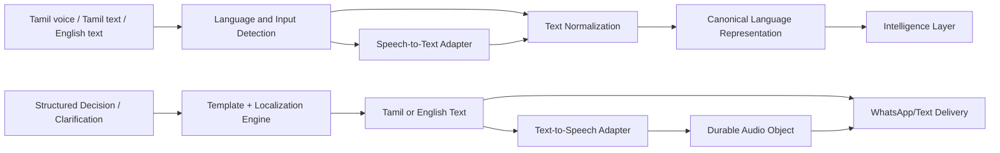
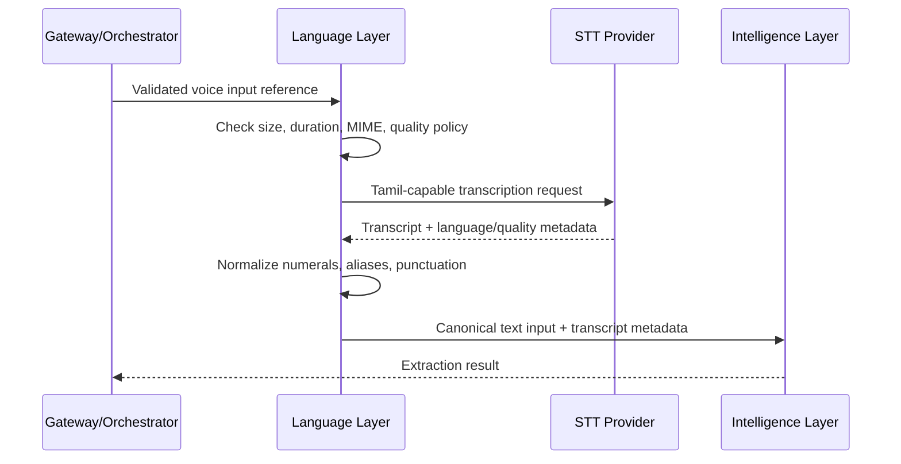
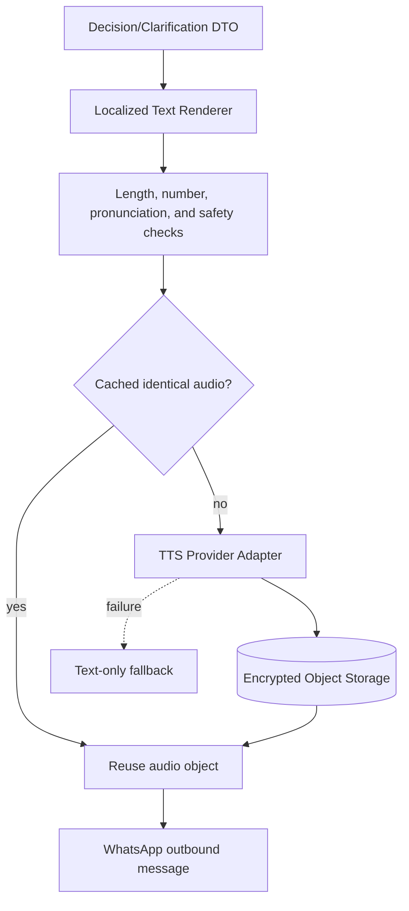

# Ermozhi — Language Layer Architecture

**Status:** Proposed production design  
**Inputs:** Tamil voice, Tamil text, English text  
**Outputs:** Tamil voice, Tamil text, English text  
**Scope:** Speech-to-text, translation, localization, and text-to-speech for rural WhatsApp users  
**Baseline:** Existing `src/response_generation_layer.py`, `src/input_process_layer.py`, and prior Intelligence/Gateway architecture documents

This document is architecture documentation only. It does not contain production implementation code.

## 1. Language Layer purpose

The Language Layer is the accessibility and presentation boundary. It converts channel input into a canonical language representation and converts structured decisions/clarifications into short, culturally appropriate, channel-ready text and optional audio.

It must never change a Decision Engine action, price, evidence reference, risk level, or confidence. It localizes facts; it does not invent them.



## 2. Responsibilities

### Speech-to-text

- Accept validated Tamil voice notes and supported audio formats.
- Select an approved Tamil-capable speech recognizer or multimodal model.
- Return transcript, detected language, confidence, timing/evidence metadata where available, and audio quality status.
- Preserve uncertainty and ask for a repeat when speech is not reliable.

### Translation

- Translate only when required by the downstream contract or user preference.
- Preserve numbers, currency, units, crop/variety names, locations, and action labels exactly.
- Keep canonical semantic fields separate from translated prose.
- Avoid round-tripping Tamil through English when a Tamil-first template exists.

### Localization

- Use Tamil-first terminology, familiar numerals/currency, short sentences, and culturally understandable prompts.
- Map canonical crop/variety/market names to approved Tamil and English display terms.
- Render action-specific templates for SELL, NEGOTIATE, HOLD, and WAIT.
- Include source date/freshness and limitations without overwhelming the user.

### Text-to-speech

- Generate optional Tamil or English voice output from approved text.
- Use a configured voice, rate, and pronunciation dictionary for crop/market names.
- Store audio durably with a lifecycle deadline; never depend on local container files.
- Return text even if TTS fails.

## 3. Input architecture

```text
LanguageInput {
  message_id,
  channel: "whatsapp" | "api" | "future_channel",
  kind: "voice" | "text",
  media_ref: optional private object reference,
  media_content_type: optional MIME type,
  text: optional string,
  locale_hint: optional "ta-IN" | "en-IN",
  user_language_preference: optional locale,
  context_ref: optional conversation context,
  deadline_at,
  contract_version
}
```

Input invariants:

- A voice input has a validated private media reference; the Language Layer never fetches arbitrary URLs.
- Text is Unicode-normalized and size-limited.
- Provider payloads are translated into this contract before entering the layer.
- Raw audio and phone identifiers are not written to ordinary logs.

## 4. Speech-to-text workflow



### STT policy

- Prefer one multimodal extraction request when it is accurate and lower latency than separate STT plus LLM calls.
- Use separate STT when the transcript is needed for audit, evaluation, search, or provider capability requires it.
- Do not send an audio file through multiple providers by default; use a bounded fallback only after a clear transient or quality failure.
- Retain transcript/audio according to the Data Layer retention policy.
- If confidence is low, request a shorter/repeated voice note or Tamil text.

## 5. Canonical language representation

The layer should keep semantic values and presentation text separate.

```text
CanonicalLanguageResult {
  canonical_text,
  detected_locale,
  source_kind,
  transcription_ref,
  language_confidence,
  text_quality: "HIGH" | "MEDIUM" | "LOW",
  normalized_number_spans,
  normalized_unit_spans,
  alias_spans,
  warnings,
  provider_metadata,
  contract_version
}
```

Numbers and units should be normalized deterministically where possible, but the original span remains available for audit and ambiguity checks.

## 6. Output architecture

```text
LanguageOutput {
  message_id,
  locale: "ta-IN" | "en-IN",
  text: {
    content,
    content_type: "plain_text",
    template_id,
    terminology_version
  },
  audio: optional {
    object_ref,
    content_type,
    duration_seconds,
    voice_id,
    expires_at
  },
  delivery_constraints,
  fallback_status: "NONE" | "TEXT_ONLY" | "CLARIFICATION",
  source_disclosure,
  contract_version
}
```

The output contains no local filesystem path. Audio is a durable object reference or signed retrieval reference suitable for the outbound channel adapter.

## 7. Response composition and localization

Responses are generated from structured facts and reason codes, not free-form model improvisation.

### 7.1 Response sections

1. **Greeting/acknowledgement:** optional and brief.
2. **Offer fact:** farmer/trader offer with unit and currency.
3. **Official reference:** observed mandi value, source label, and date/freshness.
4. **Action:** Sell, Negotiate, Hold, or Wait.
5. **Reason:** one concise fact-based explanation.
6. **Risk/limitation:** only when material.
7. **Next step:** targeted clarification or negotiation suggestion.

### 7.2 Localization rules

- Tamil is the default for Tamil input and farmer preference.
- English text is available when requested or when Tamil rendering fails.
- Do not translate canonical IDs; translate approved display labels.
- Preserve numeric values exactly; use Indian number grouping only if it is unambiguous and readable.
- Say “official mandi reference observed on [date]” rather than implying a guaranteed future price.
- Avoid technical terms such as “standard deviation” in the farmer message; map them to “recent prices changed widely” or omit unless useful.
- Keep the first message short enough for low literacy and intermittent connectivity.
- Use respectful, non-commanding language and avoid guarantees.

### 7.3 Action wording policy

| Action | Tamil/English intent | Required caveat |
|---|---|---|
| SELL | Offer is close to or above the trusted reference | Based on observed official prices; farmer decides |
| NEGOTIATE | Offer is below reference but evidence is usable | Suggest asking for a better offer; no guaranteed outcome |
| HOLD | Offer is materially low and evidence is strong | Holding costs/urgency may change the choice |
| WAIT | Evidence is missing, stale, ambiguous, or unstable | Ask for clarification or wait for a verified update |

The exact Tamil wording belongs in versioned terminology/template assets and should be reviewed with native Tamil speakers and farmers.

## 8. Translation architecture

Use a layered approach:

1. **Deterministic terminology:** crop, variety, district, market, units, action labels, and safety phrases.
2. **Templates:** high-frequency decision and clarification responses.
3. **Translation provider:** only for supported free-form text or future languages not covered by templates.
4. **Human-reviewed fallback:** approved static wording when provider confidence is low.

Avoid translating a structured decision into English and then translating that English back into Tamil. Render from canonical fields directly whenever a reviewed Tamil template exists.

## 9. Text-to-speech architecture



TTS metadata includes locale, voice ID, rate, terminology version, text hash, provider/model version, object checksum, creation time, and expiration.

## 10. Low-cost and low-latency strategy

### Cost controls

- Use deterministic templates for the common decision/clarification paths.
- Cache audio by a hash of approved text, locale, voice, and terminology version.
- Avoid TTS for duplicate retries or when text-only delivery is sufficient.
- Use one provider call per voice input whenever multimodal extraction is reliable.
- Keep audio duration and output length bounded.
- Use a lower-cost translation/STT/TTS provider for routine traffic and reserve premium fallback for failures or high-value quality cases.
- Track cost per input type, language, provider, and workflow.

### Latency controls

- Validate media and render text in parallel where possible.
- Use warm provider clients and connection pools.
- Do not wait for TTS before delivering a text response if the channel supports separate delivery.
- Generate/attach audio asynchronously after text has been prepared.
- Keep templates local and versioned.
- Cache pronunciation dictionaries and common audio.
- Set per-stage deadlines and deliver text-only when the audio budget expires.

### Rural-user controls

- Text-first fallback for poor connectivity or unsupported audio playback.
- Short voice notes with clear, slower speech and familiar terminology.
- Avoid requiring app installation, account creation, or visual dashboards.
- Keep messages understandable without literacy-heavy formatting.
- Confirm important numbers in both text and voice when possible.
- Ask one clarification question at a time.

## 11. Model/provider abstraction

The Language Layer uses provider-neutral adapters for STT, translation, and TTS. Provider selection is configuration with capability metadata, not a contract exposed to the Gateway or Decision Engine.

Each adapter declares supported locales, audio formats, maximum duration, latency/cost class, voice/model versions, retry categories, and data-retention behavior.

Replacement evaluation must cover Tamil pronunciation, crop/variety terms, Indian numbers/currency, mixed Tamil-English speech, noisy rural audio, text fallback, and latency/cost under pilot load.

## 12. Failure and fallback policy

| Failure | Behavior |
|---|---|
| Unsupported audio | Ask for supported voice/text; do not silently transcribe another way |
| Low STT confidence | Ask for a shorter/repeated voice note or text |
| Translation failure | Use reviewed template or source language; preserve canonical facts |
| TTS timeout/outage | Deliver text-only; retry audio separately if still useful |
| Audio object storage failure | Do not expose local path; retain text fallback and retry storage |
| Provider rate limit | Bounded retry with backoff and provider circuit breaker |
| Template missing for locale/action | Use approved fallback language and record the gap |
| Number/unit rendering ambiguity | Keep original value and ask clarification rather than guessing |

No language failure may change the underlying decision or evidence.

## 13. Accessibility and quality evaluation

Evaluate with native Tamil speakers and representative rural users across:

- Tamil script, transliterated Tamil, English, and mixed-language messages;
- Kongu/Tamil dialect variation and noisy voice notes;
- spoken numbers, rupees, quintals, decimals, and local variety names;
- low bandwidth, repeated delivery, and audio playback limitations;
- all four decision actions and clarification states.

Measure transcription accuracy, number/unit accuracy, action-label comprehension, pronunciation, message completion time, audio delivery rate, text-only fallback rate, p50/p95 latency, cost per request, and farmer comprehension—not just provider confidence.

## 14. Migration from the current implementation

1. Keep the existing Tamil response templates as reviewed content, but move them into versioned language assets.
2. Replace local `output_audio` paths with durable object references and lifecycle policies.
3. Add English templates and a locale-aware output contract.
4. Separate speech-to-text/input normalization from response generation.
5. Add provider adapters for STT, translation, and TTS rather than calling Edge TTS directly from the orchestrator.
6. Render from the new Decision Engine action contract, including SELL/HOLD/WAIT/NEGOTIATE and evidence caveats.
7. Deliver text independently when TTS is slow or unavailable.
8. Add pronunciation, Tamil comprehension, cost, and latency evaluation before expanding languages.

## Final recommendation

Use a Tamil-first, template-led Language Layer with provider adapters and deterministic number/term handling. Treat speech, translation, localization, and TTS as separate bounded capabilities; deliver text reliably even when voice fails; and preserve canonical facts separately from localized prose. This provides low cost, low latency, and a usable rural experience without allowing language generation to alter business decisions.

