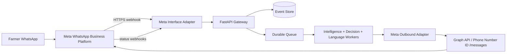
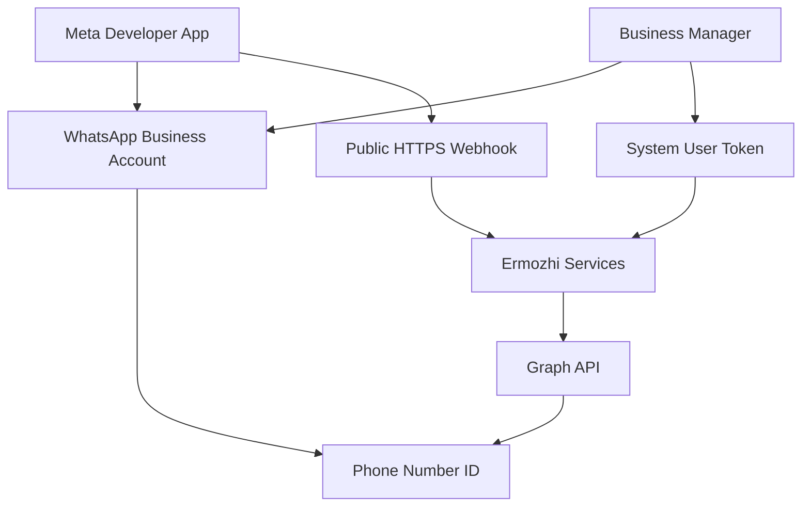
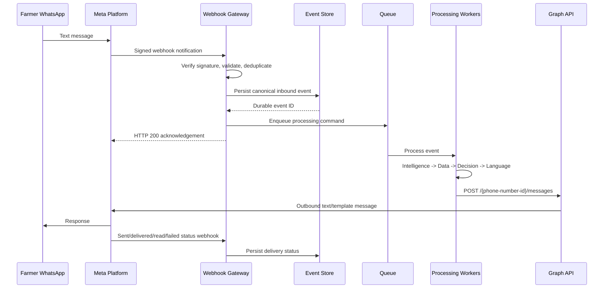
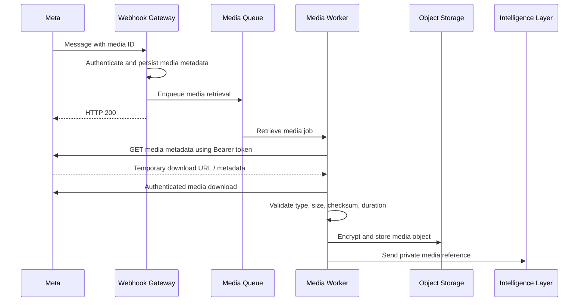
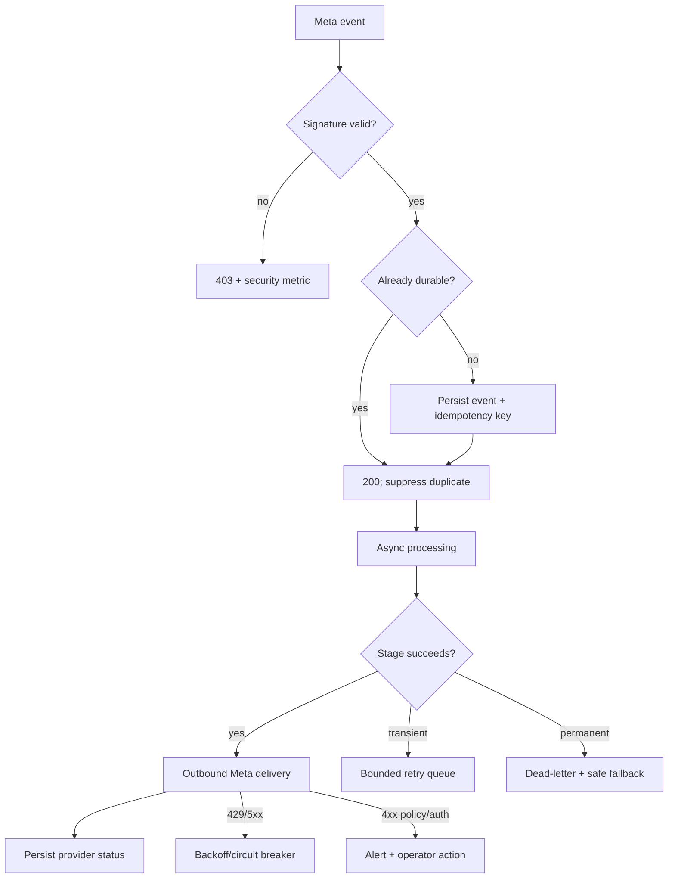

# Ermozhi — Meta WhatsApp Business Cloud API Architecture

**Status:** Proposed production integration  
**Scope:** Meta-hosted WhatsApp Business Platform Cloud API as a direct alternative to the current Twilio WhatsApp integration  
**Baseline:** Existing `src/app.py`, `server.js`, `TWILIO_SETUP.md`, and the gateway/language architecture documents

This is documentation and architecture only. It contains no implementation code.

Meta product behavior, Graph API versions, message policies, templates, limits, and pricing change over time. The production team must verify the active Meta documentation, rate card, and account configuration during each release. Official starting points are the [WhatsApp Cloud API documentation](https://developers.facebook.com/docs/whatsapp/cloud-api/), [WhatsApp Business Platform pricing](https://business.whatsapp.com/products/platform-pricing/), and Meta’s [Cloud API Postman collection](https://www.postman.com/meta/whatsapp-business-platform/documentation/wlk6lh4/whatsapp-cloud-api).

## 1. Integration position

Meta Cloud API replaces the Twilio-specific transport adapter, not the rest of the product. The Interface/Gateway contract remains channel-neutral:

```text
Meta webhook -> Meta adapter -> Canonical inbound message
Decision/Language output -> Meta outbound adapter -> Graph API /messages
```

The Intelligence, Data, Decision Engine, Language, persistence, queues, and observability layers must not depend on Meta payload shapes.



## 2. Meta Cloud API architecture

### Meta resources

- **Meta App:** owns the integration, webhook subscription, app secret, and API configuration.
- **Meta Business Manager:** owns or administers the business assets and system users.
- **WhatsApp Business Account (WABA):** contains business messaging configuration and templates.
- **Phone Number ID:** identifies the WhatsApp sender used in Graph API message calls.
- **System User access token:** long-lived server credential stored in a managed secret store; never use a temporary development token in production.
- **Graph API version:** explicitly configured and tested; upgrade before Meta’s version deprecation date.

### Logical component model



The Meta Cloud API is managed infrastructure; Ermozhi owns the webhook endpoint, event store, processing queues, media persistence, business logic, and outbound delivery state.

## 3. Message flow

### 3.1 Inbound text flow



The webhook acknowledgement means “event durably accepted,” not “recommendation completed.” The farmer response is sent asynchronously through Meta’s outbound API.

### 3.2 Message types

The adapter should normalize at least:

- text;
- audio/voice;
- image/document/sticker as unsupported or future input;
- interactive button/list replies if clarification flows use them;
- location messages if location is explicitly supported;
- status events for sent, delivered, read, and failed messages.

Unknown message types are persisted as quarantined provider events and receive a safe unsupported-input response only when appropriate.

## 4. Webhook flow

### 4.1 Verification handshake

Meta webhook setup uses a GET verification request containing a mode, verify token, and challenge. The gateway:

1. Confirms the request is for the configured webhook object/path.
2. Compares the supplied verify token with the secret held by the deployment.
3. Returns the challenge only when the token and mode are valid.
4. Returns a non-success response for invalid verification; never echo arbitrary challenge values.

The verification token is a deployment secret and is separate from the Graph API access token.

### 4.2 Signed POST notification

For POST events, validate the Meta app-secret signature, typically carried in `X-Hub-Signature-256`, over the raw request body before parsing or trusting the payload. The app secret must be read from a secret manager and never logged.

The gateway then:

- validates the expected object/entry structure;
- extracts the WABA, phone-number ID, message ID, sender, timestamp, and message type;
- stores the raw event reference and normalized canonical event;
- deduplicates by Meta message/event ID;
- acknowledges quickly after durable persistence;
- processes the event asynchronously.

### 4.3 Webhook endpoint design

| Method | Endpoint | Purpose | Authentication |
|---|---|---|---|
| `GET` | `/api/v1/channels/meta-whatsapp/webhook` | Meta verification challenge | Verify token |
| `POST` | `/api/v1/channels/meta-whatsapp/webhook` | Incoming messages and statuses | App-secret signature |
| `GET` | `/api/v1/channels/meta-whatsapp/health` | Adapter/configuration health | Internal/platform identity |
| `POST` | `/internal/v1/meta-whatsapp/replay/{event_id}` | Authorized replay | Operator identity + approval |

Do not expose a generic `/webhook` that accepts unsigned traffic in production. A compatibility alias, if retained, must route to the same strict Meta adapter and have a removal date.

## 5. Authentication and authorization

### 5.1 Inbound webhook authentication

- GET verification: high-entropy verify token held in secret manager.
- POST notifications: HMAC verification using the Meta app secret and exact raw body.
- Reject missing, invalid, or stale/replayed events according to the configured policy.
- Restrict accepted WABA IDs and phone-number IDs to the deployment configuration.

### 5.2 Outbound Graph API authentication

- Use a production system-user access token with only required WhatsApp permissions.
- Store the token in a managed secrets system and inject it at runtime.
- Rotate tokens through a controlled runbook and test before revoking the old token.
- Send the token only in the HTTPS `Authorization: Bearer` header to Graph API.
- Never pass it through queues, client responses, logs, traces, or media URLs.

### 5.3 Internal authorization

- The public webhook may enqueue only canonical inbound events.
- Only outbound workers may call `/{phone-number-id}/messages`.
- Only media workers may retrieve/download media.
- Operators need role-based access for replay, template administration, and configuration changes.
- All administrative actions are audited with actor, reason, scope, and result.

## 6. Outbound message architecture

### Graph API message operation

The outbound adapter calls the configured Graph API version and phone-number ID message endpoint. It translates a channel-neutral delivery request into Meta message JSON and records the returned provider message ID.

Logical delivery input:

```text
MetaDeliveryRequest {
  delivery_id,
  phone_number_id,
  recipient_phone_ref,
  type: "text" | "template" | "audio" | "interactive",
  text,
  template_ref,
  media_ref,
  reply_context_message_id,
  idempotency_key,
  correlation_id
}
```

The adapter returns provider message ID, accepted/sent status, error category, retryability, and rate-limit metadata when supplied. It does not return raw access tokens or full provider payloads to business layers.

### Customer-service window policy

The delivery policy must track when the user last initiated a conversation and whether a customer-service window is active. Within the permitted service window, use approved free-form replies where policy allows. Outside that window, use an approved template message with the correct category and locale. The exact window and policy must be verified against the active Meta rules during deployment.

## 7. Template messages

### Template responsibilities

- Templates are created and approved in the WABA/Meta template management flow.
- Each template has a stable internal ID, Meta name, category, language/locale, version, approval status, quality status, and variable schema.
- Production sends use the approved template name and locale; arbitrary text cannot be substituted for a template outside the permitted window.
- Template variables are typed and escaped; prices, dates, source labels, and action words must be inserted from structured data.
- A template catalog is versioned in application configuration and reconciled with Meta periodically.

### Recommended template families

| Template | Use |
|---|---|
| `price_result_ta` | Tamil price decision when a template is required |
| `price_result_en` | English price decision when a template is required |
| `clarification_variety_ta` | Ask whether the crop is Finger/Virali or Bulb/Kizhangu |
| `clarification_price_ta` | Ask for the trader’s offered price |
| `unsupported_input_ta` | Request supported text or voice input |
| `processing_delay_ta` | Safe update when processing is delayed |
| `system_retry_ta` | Temporary failure and retry guidance |

Template content should be short, non-promotional, and reviewed by native Tamil speakers. Do not encode decision thresholds in template text; the template receives the structured action and facts.

### Template failure

If Meta rejects a template because it is disabled, unapproved, or has a variable mismatch:

- classify the error as non-retryable until the catalog/configuration is corrected;
- use an allowed free-form text fallback only when the service window permits it;
- otherwise enqueue an operator-visible delivery failure and avoid repeatedly retrying the same invalid template.

## 8. Media handling

### General media flow



### Media controls

- Treat media IDs and download URLs as short-lived provider references.
- Retrieve media metadata and download with the server-side Bearer token; do not expose the token to the client or queue payload.
- Validate declared and detected MIME types, file size, duration, checksum, and content safety.
- Store media in private encrypted object storage with a retention deadline.
- Pass an object reference to the Intelligence/Language layers, not a public URL.
- Delete/quarantine unsupported or suspicious media according to retention policy.
- Record provider media ID, object checksum, source event ID, and retrieval status for replay.

Supported media should be configured, not assumed. The current product primarily needs audio; image/video/document processing remains explicitly unsupported until a separate policy is approved.

## 9. Voice-message handling

1. Meta webhook identifies an inbound audio message and supplies a media ID.
2. Gateway authenticates and persists the event without downloading audio inline.
3. Media worker retrieves metadata and downloads the audio with the system token.
4. Worker validates MIME, codec, byte size, duration, and audio quality.
5. Audio is stored privately and passed to the Language/Intelligence workflow.
6. Speech-to-text or multimodal extraction produces structured intent/entities.
7. Decision and language workers generate text and optional Tamil audio.
8. Outbound adapter uploads generated audio to Meta media storage or uses the supported media reference mechanism, then sends the audio message.
9. Text is sent alongside or as a fallback so the farmer still receives the price and action if audio delivery fails.

Voice-specific failure responses:

- empty/corrupt audio: ask for a shorter voice note or text;
- unsupported codec/type: ask for a WhatsApp voice note;
- low transcription confidence: ask one targeted clarification;
- TTS failure: deliver text-only;
- media expiry: re-fetch through the provider media ID if still valid, otherwise mark the event replayable but do not guess.

## 10. Retry strategy

Meta webhooks are treated as at-least-once delivery. The system must be idempotent.

### Inbound webhook retries

- Acknowledge only after the event and idempotency record are durable.
- Use Meta message ID/event ID plus phone-number ID as the deduplication key.
- If the event already exists, return a success acknowledgement without enqueuing duplicate processing.
- If durability is unavailable, return a non-success response only when safe so Meta can retry; never acknowledge a lost event.
- Do not perform AI, media, market, or TTS work before the acknowledgement.

### Outbound Graph API retries

| Error class | Retry | Policy |
|---|---|---|
| Network timeout/connection reset | Yes | Exponential backoff with jitter and deadline |
| HTTP 429/rate limit | Yes | Honor retry metadata/backoff; reduce concurrency |
| HTTP 5xx | Yes | Bounded retry and circuit breaker |
| Invalid token/permission | No automatic loop | Alert, rotate/fix credentials, operator replay |
| Invalid recipient/phone/WABA | No | Permanent delivery failure; audit |
| Template rejected/variable mismatch | No | Fix catalog/template; use permitted fallback |
| Media expired/invalid | Limited | Re-fetch/re-upload once, then dead letter |
| Policy/category violation | No | Correct policy/template; do not retry unchanged |

Every attempt stores delivery ID, provider message ID if returned, Graph API version, error code, retryability, attempt number, and next retry time.

## 11. Failure handling



Failure principles:

- Keep the last successful processing state; do not overwrite a completed decision with a transient failure.
- Separate user-visible fallback from operator diagnostics.
- Never retry an invalid request or rejected template indefinitely.
- Use dead-letter queues and controlled replay with the original event/policy versions.
- Alert on signature failures, token/permission errors, template failures, queue age, and delivery failure rate.
- Preserve enough event/media/extraction references to replay without receiving the original message again.

## 12. Production deployment

### Meta setup

1. Create a Meta App in the production organization.
2. Configure the WhatsApp product and production WABA/phone number.
3. Create a system user with minimum required permissions and a long-lived token.
4. Register the production webhook callback URL and verify token.
5. Subscribe the app to the WABA webhook fields needed for messages and statuses.
6. Create and obtain approval for Tamil/English templates and record their identifiers.
7. Configure the production phone-number ID, WABA ID, app ID, Graph API version, and secret references.
8. Verify inbound signature handling and outbound message/media flows in a non-production WABA before cutover.

### Cloud deployment

- Deploy the webhook gateway as a stateless HTTPS service with multiple replicas.
- Put queues, workers, database, object storage, and secrets behind private networking and workload identity.
- Separate webhook ingress capacity from AI/media/TTS worker capacity.
- Use readiness checks that require durable event persistence and queue publication, not Gemini/TTS availability.
- Configure autoscaling on request rate, queue age, media jobs, Graph API response codes, and provider concurrency.
- Pin and test Graph API version upgrades before Meta’s deprecation deadline.
- Store configuration per environment; never reuse sandbox WABA IDs/tokens in production.

### Cutover from Twilio

- Keep the canonical Interface/Gateway contracts unchanged.
- Implement Meta as a new channel adapter and outbound adapter.
- Run Twilio and Meta in separate environments or phone numbers during validation.
- Do not route one inbound message through both providers.
- Migrate templates, status handling, media storage, and monitoring before moving traffic.
- Retire the Node/Twilio proxy only after delivery, retry, and replay metrics are stable.

## 13. Cost model

Meta pricing is not a fixed “API call” price. The active rate card can vary by recipient country/market, message category, volume tier, and policy period. The platform currently distinguishes message categories such as service, utility, authentication, and marketing; the exact prices and free/chargeable cases must be read from the current Meta rate card at deployment time.

### Cost components

- Meta delivered-message charges according to the active category/rate card.
- AI extraction and transcription costs.
- TTS/translation costs.
- Cloud gateway, queue, database, object storage, egress, and observability costs.
- Operational cost for template approval, support, and incident handling.

### Cost controls

1. Prefer user-initiated service replies and free-form responses when permitted by the active service-window policy.
2. Use one concise response containing the essential text and optional audio rather than multiple messages.
3. Avoid sending separate status/progress messages unless the delay is material.
4. Use approved utility templates only when the window/policy requires them.
5. Cache/reuse generated audio for identical text, locale, voice, and version.
6. Do not retry permanent 4xx/template errors.
7. Track delivered messages by category, country code, template, and provider response.
8. Budget AI/TTS calls separately from Meta message costs; avoid duplicate processing from webhook retries.

The business must maintain a rate-card configuration with effective date, category, destination-market assumptions, and an alert when Meta pricing or policy changes.

## 14. Scaling strategy

### Gateway and webhook

- Stateless replicas behind a managed load balancer.
- Fast signature verification, parsing, durable write, and acknowledgement.
- Scale on request rate, p95 acknowledgement latency, connection count, and persistence latency.

### Workers

- Separate queues for media retrieval, intelligence, decision/data lookup, language/TTS, outbound delivery, and status processing.
- Scale on queue age/depth and provider quotas, not merely CPU.
- Apply per-phone-number and per-WABA concurrency limits according to Meta account capabilities.
- Use backpressure during Graph API 429 responses.

### Data and media

- Store inbound/outbound events and status transitions durably.
- Use object storage for audio; do not serve from ephemeral application disks.
- Use the Data Layer cache for market snapshots so a message burst does not multiply government API calls.
- Partition media and event retention by policy; keep only audit references after expiration.

### Reliability targets

Recommended initial targets:

- Webhook acknowledgement p95 below the provider retry-sensitive budget.
- 99.9% gateway availability.
- No lost durably accepted events.
- Duplicate inbound events produce at most one logical outbound response.
- Queue age and delivery latency visible by channel, action, locale, and provider error class.

## 15. Observability and audit

Track `provider_event_id`, Meta message ID, WABA ID, phone-number ID, `message_id`, `delivery_id`, `conversation_id`, `correlation_id`, Graph API version, template name/category, media ID, attempt number, and final status.

Metrics:

- webhook verification failures and accepted events;
- duplicate suppression rate;
- media download/upload latency and failure rate;
- Graph API response codes, 429 rate, token/permission failures, and message category;
- template rejection/quality status;
- outbound sent/delivered/read/failed status;
- queue age/retry/dead-letter counts;
- end-to-end time to farmer-visible response;
- cost by delivered message category and destination market.

Do not log app secrets, access tokens, full phone numbers, raw media URLs with credentials, or complete raw payloads in normal logs.

## 16. Production checklist

- [ ] Production WABA, phone-number ID, and business verification completed.
- [ ] System user token stored and rotated through secret management.
- [ ] Webhook GET verification and POST app-secret signature tests pass.
- [ ] WABA subscriptions and required webhook fields are confirmed.
- [ ] Graph API version is pinned with an upgrade owner/date.
- [ ] Tamil/English templates are approved, versioned, and monitored.
- [ ] Message/event idempotency is tested with duplicate webhooks.
- [ ] Media retrieval uses private storage and bounded validation.
- [ ] Audio text fallback is tested when TTS/media delivery fails.
- [ ] 429/5xx/4xx retry matrix and dead-letter replay are tested.
- [ ] Cost reporting distinguishes Meta messages from AI/TTS/cloud costs.
- [ ] Cutover and rollback runbooks are rehearsed.

## Final recommendation

Implement Meta Cloud API as a secure channel adapter behind the existing canonical Gateway contract. Acknowledge only durably persisted events, process media and AI work asynchronously, use system-user bearer authentication for Graph API calls, validate app-secret signatures on webhooks, keep templates versioned and policy-aware, and make every provider operation idempotent. This provides a scalable direct-Meta path while preserving the Intelligence, Data, Decision, and Language architecture already defined.

