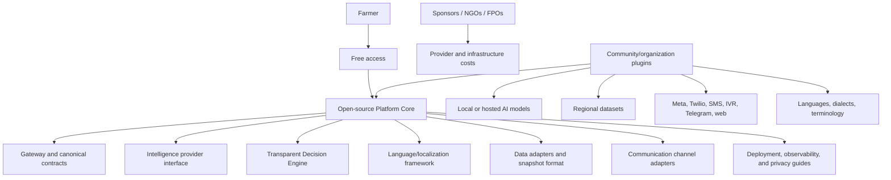
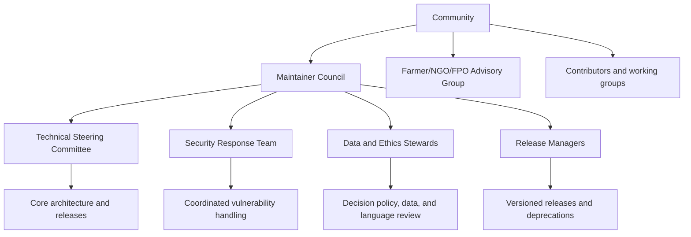
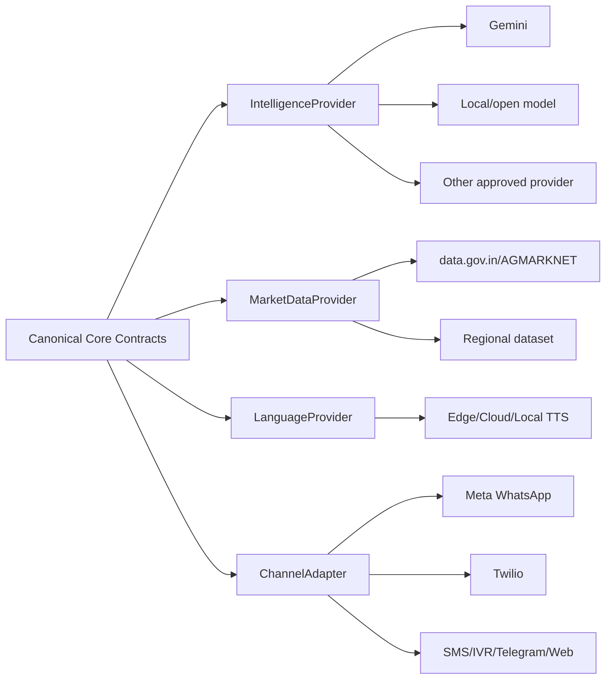
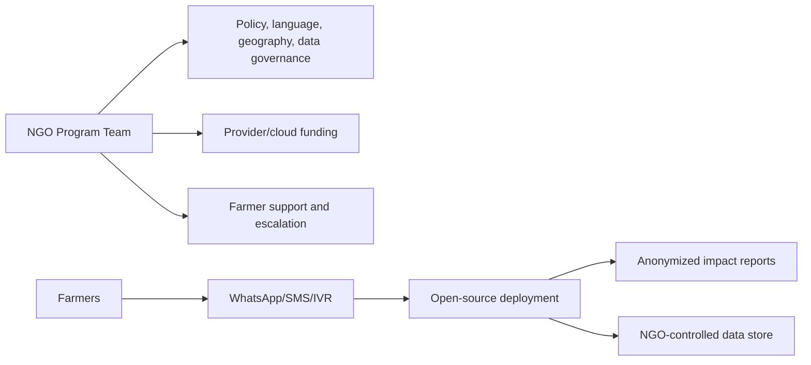
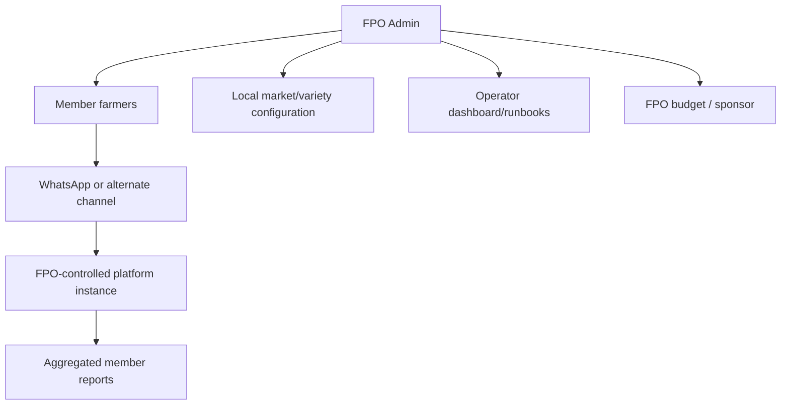

# Ermozhi — Open-Source Strategy

**Status:** Proposed community edition strategy  
**Purpose:** Make farmer-facing price verification free to farmers while keeping the project community-maintained, transparent, provider-neutral, and deployable by independent organizations  
**Baseline:** Existing codebase review and the architecture documents in `overView/`

This is a strategy and governance document only. It does not contain implementation code.

## 1. Vision and operating principles

Ermozhi should be a public-interest, open-source decision-support platform that gives farmers access to understandable market evidence without charging them for the interaction. The platform must be honest about the costs that still exist: cloud compute, storage, AI providers, speech services, messaging providers, data operations, support, and governance.

### Principles

1. **Free at the farmer interface:** Farmers are not charged per message, recommendation, or voice note.
2. **Sponsor-funded operations:** NGOs, FPOs, public programs, grants, donors, or responsible sponsors fund provider and infrastructure costs.
3. **Transparent decisions:** Every recommendation exposes the source snapshot, date, reference-price method, policy version, confidence, risk, and limitations.
4. **No hidden provider lock-in:** AI, TTS, market sources, storage, and communication channels are adapters.
5. **Data sovereignty:** A deploying organization owns or controls its farmer data and can export/delete it.
6. **Community review:** Domain policy, translations, datasets, and safety behavior require review beyond one original team.
7. **Safe uncertainty:** The system can say WAIT or insufficient evidence; it must not invent certainty.
8. **Reproducibility:** A historical decision can be replayed from stored input, evidence, policy, and engine versions.
9. **Inclusive contribution:** Farmers, translators, FPO operators, NGOs, developers, data stewards, and security researchers are first-class contributors.

## 2. Open-source product boundary



### Core versus deployment-specific configuration

**Core and public:**

- canonical event and layer contracts;
- deterministic Decision Engine and policy schema;
- provider/channel interfaces;
- sample/synthetic datasets and fixtures;
- localization framework and reviewed baseline terminology;
- self-hosting documentation;
- privacy, threat-model, and operational guidance;
- conformance and evaluation specifications.

**Deployment-specific:**

- API keys, Meta/Twilio accounts, phone numbers, and templates;
- farmer identity and conversation data;
- regional data licenses and private datasets;
- active thresholds/policies approved by the operator;
- model/provider choice and spend limits;
- organization branding and escalation contacts.

No deployment should have to modify core code to select a model, channel, market source, language, or policy version.

## 3. Licensing strategy

The repository currently carries an MIT license. Preserve that license for the initial community release unless the maintainers obtain formal legal advice to change it.

### Recommended license boundaries

| Asset | Recommended treatment | Reason |
|---|---|---|
| Core software and adapters | Existing MIT license | Maximum adoption and reuse; compatible with NGO/FPO deployment |
| Documentation and diagrams | CC BY 4.0 or repository-compatible documentation terms | Encourage translation and reuse with attribution |
| Policy files and templates | Open license with attribution and versioning | Public review and localized adaptation |
| Sample/synthetic data | Explicit data license in each dataset directory | Avoid confusing source-derived rights with code rights |
| Government/source data | Follow each source’s license/terms; do not redistribute blindly | Source terms may restrict copying or commercial reuse |
| Farmer messages/audio | Never bundled as public training data without explicit consent and de-identification | Privacy and trust |

The project must publish a `NOTICE`/attribution inventory and a third-party dependency/license report. This is a strategy recommendation, not legal advice; obtain review before accepting proprietary or restricted datasets.

## 4. Governance model

### 4.1 Governance bodies



### Maintainer Council

Responsible for project direction, membership, release authority, conflicts of interest, funding transparency, and succession. It should include technical maintainers plus at least one public-interest/domain representative.

### Technical Steering Committee

Approves architecture changes, contracts, compatibility policy, provider interfaces, security-sensitive changes, and release readiness. Decisions are recorded as Architecture Decision Records (ADRs).

### Data and Ethics Stewards

Review:

- market-data provenance and license;
- decision thresholds and action semantics;
- confidence/risk wording;
- Tamil/local-language translations;
- privacy/retention policies;
- farmer impact and harmful failure modes.

### Security Response Team

Maintains the threat model, security policy, private reporting channel, patch process, dependency advisories, and incident communications.

### Advisory Group

FPOs, NGOs, farmers, translators, agricultural experts, and field operators provide structured feedback. They do not need code access to influence policy, usability, or language decisions.

### Decision making

- Routine changes: maintainer review plus required checks.
- Contract/API changes: TSC approval and ADR.
- Decision-policy changes: Data/Ethics review, evaluation evidence, and versioned release notes.
- Security changes: Security Team review; disclose after remediation.
- Breaking changes: public proposal, migration plan, deprecation period, and release notes.

Publish meeting notes, accepted/rejected proposals, conflict disclosures, release decisions, and sponsorship summaries.

## 5. Repository structure

```text
ulavan-connect/
├── README.md                         Project purpose, scope, quick start
├── LICENSE                           Software license
├── NOTICE                            Third-party and data attribution
├── CODE_OF_CONDUCT.md                Community behavior policy
├── CONTRIBUTING.md                   Contribution workflow and checks
├── GOVERNANCE.md                     Roles, decision rights, elections/succession
├── SECURITY.md                       Vulnerability reporting and response
├── PRIVACY.md                        Data handling, retention, deletion, consent
├── SUPPORT.md                        Community support boundaries
├── CHANGELOG.md                      Release history
├── docs/
│   ├── architecture/                 Layer and deployment architecture
│   ├── operations/                   Runbooks, SLOs, backup, incident response
│   ├── deployment/                   Self-host, NGO, FPO, cloud deployment
│   ├── decisions/                    Architecture Decision Records
│   ├── governance/                   Proposals, policies, meeting records
│   ├── localization/                 Translation and terminology guides
│   └── evaluation/                   Accuracy, safety, latency, and cost reports
├── src/
│   ├── gateway/                      Canonical ingress and routing
│   ├── intelligence/                 Provider-neutral AI contracts/adapters
│   ├── decision_engine/              Deterministic rules and policy evaluation
│   ├── language/                     STT, localization, templates, TTS adapters
│   ├── data/                         Source adapters, normalization, snapshots
│   ├── channels/                     Meta, Twilio, SMS, IVR, web adapters
│   └── platform/                     Storage, queues, telemetry, secrets abstractions
├── policies/
│   ├── decision/                     Versioned thresholds and action policies
│   ├── safety/                        Confidence, risk, fallback rules
│   ├── retention/                     Data retention/deletion defaults
│   └── channels/                      Template and messaging policies
├── locales/
│   ├── ta-IN/                         Tamil terminology and reviewed templates
│   ├── en-IN/                         English terminology and templates
│   └── CONTRIBUTING.md                Translation review process
├── datasets/
│   ├── fixtures/                      Synthetic/public test data only
│   ├── schemas/                       Canonical dataset schemas
│   └── source-notices/                Per-source license/provenance records
├── plugins/
│   ├── intelligence/                  Model provider plugins
│   ├── channels/                      Communication provider plugins
│   ├── market-data/                   Regional/source adapters
│   └── language/                      STT/TTS/translation providers
├── tests/
│   ├── contracts/                     Provider/channel contract tests
│   ├── decision/                      Golden decision and replay tests
│   ├── intelligence/                  Multilingual evaluation fixtures
│   ├── localization/                  Terminology/pronunciation tests
│   ├── security/                      Signature, auth, abuse, privacy tests
│   └── integration/                   Self-hosted and deployment smoke tests
├── deploy/
│   ├── compose/                       Local/small-organization profile
│   ├── azure/                         Azure Container Apps profile
│   ├── kubernetes/                    Community Kubernetes profile
│   └── examples/                      Environment configuration templates
└── tools/
    ├── evaluation/                    Reproducible evaluation runners
    ├── migration/                     Schema/policy migration guides
    └── release/                       Release/checklist documentation
```

The repository structure is a target organization, not a request to implement these directories now.

## 6. Contribution guidelines

### Contribution types

- Code and adapter contributions;
- decision-policy proposals;
- market-data source adapters and provenance records;
- Tamil/English/local-language translations;
- farmer usability feedback and field research;
- evaluation cases and safety tests;
- deployment guides and operations runbooks;
- documentation, diagrams, and accessibility improvements.

### Required contribution process

1. Open an issue or proposal describing the user/community problem and scope.
2. Identify affected contracts, data, policy, privacy, and deployment surfaces.
3. For architecture or policy changes, submit an ADR or Decision Policy Proposal.
4. Add tests/evaluation cases and documentation.
5. Declare data provenance and license for any dataset or example.
6. Use the project Code of Conduct and sign the project’s chosen contribution attestation/DCO process.
7. Obtain required reviewer approvals.
8. Merge only after compatibility, security, localization, and rollback checks pass.

### Review rules by change type

| Change | Required review |
|---|---|
| Decision thresholds/action semantics | Decision steward + TSC + evaluation report |
| New AI provider/model | Intelligence maintainer + benchmark/safety report |
| New channel | Channel maintainer + security + delivery/retry tests |
| New dataset | Data steward + license/provenance + quality contract |
| New language | Native-language reviewer + terminology tests + field review |
| Personal-data handling | Security/privacy review |
| Deployment change | Platform maintainer + cost/rollback documentation |

### What must not be accepted casually

- Real farmer data, phone numbers, or audio in public fixtures;
- credentials, tokens, or private provider URLs;
- undocumented changes to thresholds or confidence wording;
- a model that returns recommendations without the stable contract;
- a source dataset without license/provenance information;
- a channel adapter that bypasses signature/authentication or idempotency;
- translations that change numeric values, units, action semantics, or risk caveats.

## 7. Transparent Decision Engine program

Transparency is a product feature, not only a code-license property.

Every recommendation should expose:

- action: SELL, NEGOTIATE, HOLD, or WAIT;
- offered price, unit, and currency;
- official reference price and aggregation method;
- source, market, variety, and observation window;
- freshness and quality status;
- score, confidence band, and risk level;
- reason codes and limitations;
- decision-policy version and engine version;
- evidence/snapshot references sufficient for replay.

### Policy governance

- Policies are data/configuration artifacts, versioned and effective-dated.
- Threshold changes require a proposal, domain review, evaluation set, and release notes.
- Deployments can pin a policy version and compare a candidate policy in shadow mode.
- The project publishes examples showing how a price flows through the rules.
- A farmer-facing explanation must be derived from the same structured facts as the audit record.
- The engine fails to WAIT when comparable evidence is not available; it never silently defaults to a different variety or market.

## 8. Pluggable AI providers and pluggable communication channels architecture



### Plugin contract principles

- Provider plugins return canonical input/output types.
- Credentials and provider configuration remain deployment-local.
- Plugins declare capabilities: languages, modalities, limits, cost class, latency, privacy behavior, and retry categories.
- The core does not depend on a plugin’s SDK types.
- Each plugin has contract tests, failure tests, and a documented license.
- A deployment can run with no external AI provider for deterministic/fixture testing, and with local models where available.

### Free-for-farmers implication

“Free” means the farmer is not billed. It does not mean third-party services are free. Each deployment chooses one of:

- locally hosted/open models and self-hosted speech/TTS;
- donated/cloud credits;
- NGO/FPO grant or program funding;
- sponsor-funded shared service;
- a mixed mode with local fallback and paid provider only for difficult cases.

The default product must not monetize farmer data or expose it to providers beyond the deployment’s consent and privacy policy.

## 9. Deployment options

### 9.1 Local/community development

Purpose: contributor evaluation, demo, translation, and policy work.

- Local container profile or equivalent documented runtime.
- Synthetic/sample market data.
- Mock or local Intelligence/Language providers.
- No real farmer data or production credentials.
- Contract tests run without paid provider access.

### 9.2 Small self-hosted deployment

Purpose: an individual FPO, NGO pilot, university, or district program.

- One organization-controlled VM or small container host.
- Gateway, worker, storage, and scheduled ingestion services.
- Organization-controlled database/object storage/queue equivalents selected by the deployment profile.
- Optional managed AI/TTS providers or local models.
- Organization-owned channel account and templates.
- Daily backups, secret rotation, health dashboard, and a named operator.

Recommended for organizations with technical support and a clear data owner. The project should publish a capacity worksheet rather than promise that a single low-cost machine supports arbitrary traffic.

### 9.3 Managed cloud deployment

Purpose: multi-site service operated by a foundation, public program, or technical partner.

- Stateless gateway and workers with independent scaling.
- Durable event/media/market stores and queues.
- Managed secret and telemetry services.
- Per-tenant policy, locale, channel, retention, and data boundaries.
- Automated backups, restore drills, incident response, and spend budgets.

The existing Azure design is one managed-cloud profile; the open-source project must keep the core portable and document equivalents for other clouds/self-hosting.

### 9.4 Offline/low-connectivity profile

For field programs with intermittent connectivity:

- queue outbound work locally;
- cache the latest approved market snapshot;
- expose a clear freshness indicator;
- retry sync when connectivity returns;
- avoid making stale data look current;
- provide SMS/IVR or human-assisted fallback where WhatsApp is unavailable.

## 10. NGO deployment model

### Operating model

An NGO operates or sponsors a deployment for a defined geography and farmer program. It owns the service configuration and is accountable for consent, support, localization, data retention, and impact measurement.



### NGO responsibilities

- Obtain informed consent and communicate limitations.
- Appoint a data protection/ethics owner and technical operator.
- Fund or provision cloud/provider costs without charging farmers.
- Validate local market/variety mappings and Tamil terminology.
- Review decision policies with agricultural advisors.
- Publish an impact and incident summary appropriate to the program.
- Avoid using recommendations as coercive sales, credit, or eligibility decisions.

### Recommended NGO tenancy

Default to a dedicated deployment or strongly isolated tenant for sensitive field programs. Shared infrastructure is acceptable only with verified logical isolation, tenant-scoped encryption/access, separate retention, and export/deletion guarantees.

## 11. FPO deployment model

### Operating model

An FPO or farmer cooperative operates the service for its members, using its own approved phone number/channel account and local market configuration.



### FPO responsibilities

- Own the channel account, templates, secrets, and operator access.
- Define supported crops, varieties, districts, grades, and market sources.
- Train a small support group to explain WAIT/NEGOTIATE/HOLD results.
- Monitor freshness and provider failures.
- Never publish member phone numbers or voice notes in public issue trackers.
- Use aggregated reporting by default; require consent for individual case studies.

### FPO value without farmer fees

- collective access to verified price evidence;
- shared cost sponsorship;
- localized language and market terms;
- member education and negotiation support;
- anonymized trend reporting for FPO operations;
- the ability to export data and change providers without losing the core system.

## 12. Data governance and privacy

- The deploying NGO/FPO is the data controller/operator for its farmer data unless a separate agreement says otherwise.
- The open-source project should not receive production farmer data for routine support.
- Public issues use synthetic or redacted examples.
- Raw audio and phone-linked events have short, documented retention by default.
- Market source data retains its source license and provenance.
- Farmers can request correction/deletion through the deploying organization.
- Analytics exports are aggregated and privacy-reviewed.
- AI provider sharing is explicit, configurable, and minimized; local models are supported for sensitive deployments.

## 13. Support and sustainability

### Support tiers

| Tier | Maintained by | Scope |
|---|---|---|
| Community | Community maintainers | Documentation, issues, reproducible bugs, public plugins |
| Deployment operator | NGO/FPO/partner | Credentials, cloud bills, local data, channel account, user support |
| Sponsor/technical partner | Funded support team | Managed upgrades, incidents, compliance, custom integrations |

The community project must not imply 24/7 support for an unstaffed self-hosted deployment. Publish an upgrade policy, supported versions, security-response expectations, and an end-of-life schedule.

### Funding options

- grants and public-interest funding;
- NGO/FPO program budgets;
- foundation sponsorship;
- cloud/provider credits;
- paid deployment/support from institutions while keeping farmer access free;
- donations earmarked for translation, accessibility, security, and infrastructure.

Avoid advertising-funded farmer data, opaque broker sponsorship, or incentives that could bias thresholds or recommendations.

## 14. Release and quality strategy

### Release channels

- **Nightly/development:** experimental plugins and policy proposals.
- **Preview:** candidate adapters, languages, and datasets with explicit warnings.
- **Stable:** supported core contracts, reviewed policies, and tested deployment profiles.
- **Long-term support:** optional version for NGOs/FPOs needing slower upgrade cadence.

### Release gates

- deterministic decision replay passes;
- multilingual/audio extraction evaluation passes;
- localization preserves values/units/actions;
- channel signature/idempotency/delivery tests pass;
- no known high-severity security issue;
- data-source license/provenance records are complete;
- backup/restore and rollback documentation is updated;
- cost and provider fallback behavior is documented.

## 15. Recommended first open-source milestone

1. Publish the architecture and contribution/governance documents.
2. Clean the repository of generated audio, private credentials, stale paths, and contradictory provider claims.
3. Reconcile the existing MIT license and add attribution/data notices.
4. Extract canonical contracts for Gateway, Intelligence, Decision, Language, Data, and Channels.
5. Publish a deterministic Decision Engine and synthetic evaluation set.
6. Add one communication adapter and one alternate/mock adapter.
7. Add Tamil/English reviewed templates and translation contribution workflow.
8. Publish a self-hosted deployment profile and restore procedure.
9. Run a small NGO/FPO pilot with a documented data/consent plan.
10. Publish the pilot’s anonymized accuracy, latency, cost, and usability findings.

## 16. Open-source success measures

### Access

- farmer-facing usage has no direct fee;
- number of active NGO/FPO deployments;
- supported districts, crops, languages, and channels;
- percentage of deployments able to run without a proprietary AI provider.

### Trust

- percentage of decisions with evidence/policy references;
- WAIT rate and false-confidence rate;
- reproducible decision replay success;
- public policy/data/translation review coverage;
- privacy incidents and time to response.

### Community

- active maintainers and non-original contributors;
- accepted adapters/locales/datasets;
- contribution review time;
- security response time;
- supported release upgrade rate.

### Sustainability

- infrastructure cost per farmer interaction;
- provider spend covered by sponsors/programs;
- deployment operator retention;
- percentage of costs attributable to avoidable retries or unbounded storage;
- documented succession and funding runway.

## Final recommendation

Release Ulavan Connect as a portable MIT-licensed public-interest core with explicit contracts, a deterministic and inspectable Decision Engine, provider-neutral AI/channel adapters, strict data governance, and deployment profiles for self-hosting, NGOs, FPOs, and managed cloud sponsors. Keep farmer access free by shifting unavoidable costs to transparent operators and sponsors, never by monetizing farmer data or hiding provider dependency. The strongest open-source asset is not only the code; it is the public policy, evidence, evaluation, localization, and governance system around the code.
