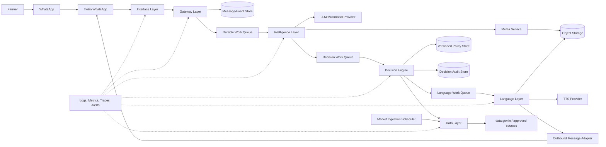

# Ermozhi — Production Architecture Redesign

**Status:** Proposed production target architecture  
**Audience:** Engineering, platform, security, data, and operations teams  
**Scope:** WhatsApp-first farmer price verification, extensible to additional channels, crops, regions, and languages  
**Baseline:** `overView/ARCHITECTURE_REVIEW.md`

This document defines the production architecture only. It does not prescribe implementation code. It converts the current synchronous hackathon pipeline into a durable, asynchronous, observable, and secure service.

## 1. Design goals and non-goals

### Goals

- Accept text and voice requests from WhatsApp with a stable external contract.
- Respond with evidence-backed, deterministic recommendations.
- Preserve the source market evidence, extraction result, policy version, and final response for auditability.
- Tolerate provider failures, duplicate webhooks, slow media processing, and deploys.
- Scale independently across ingress, AI extraction, decisioning, language generation, and data ingestion.
- Keep channel-specific concerns out of the business decision engine.
- Support Tamil first while making additional languages and channels configuration, not rewrites.

### Non-goals for the first production release

- Executing trades, payments, logistics, or marketplace transactions.
- Predicting future prices.
- Replacing official market or grading authorities.
- Treating AI output as an unreviewed financial guarantee.

## 2. Target architecture at a glance



The runtime is event-driven after ingress. The public webhook acknowledges receipt quickly; workers perform media download, extraction, market lookup, decisioning, voice generation, and outbound delivery. Every stage is retryable and idempotent.

## 3. Layer definitions

The six required layers are logical boundaries. They may initially be deployed as a small number of services, but their contracts must remain independent.

### 3.1 Interface Layer

**Purpose:** Represent the farmer-facing interaction channel and translate channel payloads into a canonical inbound message.

**Responsibilities**

- Receive Twilio WhatsApp webhooks.
- Support text, audio, delivery callbacks, and provider retry metadata.
- Validate basic transport shape and media metadata.
- Preserve the original provider event for audit/debugging without exposing it to domain logic.
- Translate internal outbound messages into TwiML or Twilio outbound API requests.
- Return a fast acknowledgement to Twilio.
- Provide channel-neutral hooks for future SMS, web, IVR, or mobile clients.

**Does not own**

- Gemini calls, market calculations, policy thresholds, or Tamil wording.
- Long-running processing.
- User authorization decisions beyond channel/provider validation.

**Boundary**

Public internet to the controlled application perimeter. Only this layer accepts provider webhooks.

### 3.2 Gateway Layer

**Purpose:** Protect and coordinate the platform after channel translation.

**Responsibilities**

- Verify Twilio signatures using the canonical externally visible URL.
- Apply rate limits, request-size limits, content-type allowlists, and replay/duplicate detection.
- Resolve or create a participant and conversation reference without trusting user-supplied identity fields.
- Assign a correlation ID, message ID, tenant/region context, and policy context.
- Persist the inbound event before acknowledging it.
- Enqueue work and expose internal status APIs for operations.
- Enforce timeouts, deadlines, retries, dead-letter routing, and idempotency.
- Redact secrets and sensitive payload fields from logs.

**Does not own**

- Semantic extraction or business classification.
- Direct public access to internal data stores.

**Boundary**

The gateway is the trust boundary between public channel adapters and private application services. Workers and stores are private-network components.

### 3.3 Intelligence Layer

**Purpose:** Convert unstructured farmer input into a validated, uncertainty-aware domain request.

**Responsibilities**

- Retrieve approved audio from object storage or a validated provider URL.
- Normalize audio metadata and enforce file size/duration/type limits.
- Use a multimodal AI provider for transcription and entity extraction.
- Extract crop, variety, offered price, unit, quantity, market/location, language, intent, and confidence.
- Map Tamil synonyms and common spelling/dialect variants to canonical domain values.
- Return structured output with evidence spans or transcription where permitted.
- Distinguish missing, ambiguous, unsupported, and confidently extracted fields.
- Apply schema validation and deterministic post-validation; never trust raw model JSON.

**Does not own**

- The final fair/negotiation/too-low decision.
- User-facing prose or audio synthesis.
- Market source freshness policy.

**Boundary**

AI provider access is private and credentialed. Model output is untrusted input to downstream services.

### 3.4 Decision Engine Layer

**Purpose:** Produce an explainable recommendation from validated domain input, trusted market evidence, and a versioned policy.

**Responsibilities**

- Resolve a canonical market snapshot for the requested crop, variety, region, unit, and date.
- Reject or downgrade recommendations when evidence is stale, missing, incomparable, or ambiguous.
- Calculate the reference price using a documented aggregation rule.
- Apply versioned thresholds and policy rules.
- Produce classification, percentage difference, confidence, evidence references, and reason codes.
- Record the exact policy version, data snapshot ID, and engine version used.
- Support deterministic replay from stored inputs.

**Does not own**

- AI interpretation of free-form messages.
- TTS, WhatsApp formatting, or provider-specific transport.
- Silent fallback to a different variety or market.

**Boundary**

This is the principal business trust boundary. Only validated, canonical inputs and explicitly identified market evidence are accepted.

### 3.5 Language Layer

**Purpose:** Convert the decision and clarification outcomes into culturally appropriate, accessible, channel-ready responses.

**Responsibilities**

- Localize structured outcomes into Tamil and supported languages.
- Render text summaries, clarification prompts, warnings, and source/freshness disclosures.
- Apply terminology dictionaries for crop and variety names.
- Generate TTS audio through a provider abstraction.
- Store audio in durable object storage and return an object reference, not a local filesystem path.
- Enforce message length, media format, and WhatsApp template/session rules.
- Provide a text fallback when TTS fails.

**Does not own**

- Changing a decision to make it sound more persuasive.
- Inventing prices, dates, market evidence, or confidence.
- Direct access to secrets or internal databases.

**Boundary**

The layer may see the decision DTO and approved evidence labels, but should not receive unnecessary personal data.

### 3.6 Data Layer

**Purpose:** Provide durable, versioned, queryable state and market evidence.

**Responsibilities**

- Store participants, conversations, inbound/outbound events, processing attempts, decisions, and audit records.
- Store normalized market observations and immutable ingestion batches.
- Maintain crop/variety/market/unit mappings and policy versions.
- Provide freshness, provenance, and data-quality status.
- Store large media in object storage with encryption, lifecycle policies, and access controls.
- Support idempotency keys, replay, operational queries, and retention/deletion workflows.
- Expose repositories or internal APIs rather than allowing arbitrary SQL from other layers.

**Does not own**

- AI interpretation or business policy decisions.
- Public webhook handling.

**Boundary**

Private network only. Different data classes require separate access policies: operational database, market data, media objects, and audit/security logs.

## 4. Communication model

### 4.1 Synchronous communication

Use synchronous calls only for short, bounded operations:

- Interface → Gateway: canonical inbound event submission.
- Gateway → Data: persist event and idempotency record.
- Decision Engine → Data: retrieve a market snapshot and policy version.
- Operations → Gateway: status/read-only diagnostics.

Each call has an explicit deadline, bounded payload, correlation ID, and typed error response.

### 4.2 Asynchronous communication

Use durable queues for all provider-dependent or long-running work:

```text
InboundMessageAccepted
  -> InputPrepared
  -> IntelligenceExtracted
  -> DecisionProduced
  -> ResponseRendered
  -> OutboundDeliveryRequested
  -> OutboundDeliveryConfirmed / DeliveryFailed
```

Each event carries `event_id`, `message_id`, `conversation_id`, `correlation_id`, `attempt`, `occurred_at`, `schema_version`, and a redacted payload reference. Events are immutable. Consumers are idempotent.

### 4.3 Communication rules

- No layer imports another layer's database models directly.
- No AI provider response is passed through without schema validation.
- No provider-specific payload is used beyond its adapter.
- No layer retries indefinitely; retry policy is owned by the gateway/worker runtime.
- Every response contains a source/freshness indicator when a market decision is returned.
- Data access is least-privilege and service-to-service authenticated.

## 5. Internal API contracts

These are logical contracts, not implementation code. JSON examples are illustrative schemas.

### 5.1 Canonical inbound message

```text
POST /internal/v1/messages
Headers: Idempotency-Key, X-Correlation-Id

{
  message_id,
  channel: "whatsapp",
  provider_message_id,
  participant_ref,
  conversation_ref,
  input: {
    kind: "text" | "audio",
    text,
    media_ref,
    media_content_type,
    media_duration_seconds
  },
  received_at,
  locale_hint,
  channel_metadata_ref
}
```

Response: `202 Accepted` with `message_id`, `correlation_id`, `processing_status`, and a deduplication indicator.

### 5.2 Intelligence result

```text
{
  message_id,
  extraction_id,
  transcription_ref,
  language: "ta",
  intent: "PRICE_EVALUATION" | "CLARIFICATION_NEEDED" | "UNSUPPORTED",
  entities: {
    crop,
    variety,
    offered_price: { value, currency, unit },
    quantity: { value, unit },
    market,
    region
  },
  missing_fields,
  ambiguity_reasons,
  confidence: { overall, field_scores },
  model: { provider, model, version },
  created_at
}
```

### 5.3 Decision request/result

```text
{
  decision_request_id,
  extraction_id,
  canonical_input: { crop, variety, region, offered_price, quantity, unit },
  market_snapshot_id,
  policy_version,
  requested_at
}
```

```text
{
  decision_id,
  classification: "FAIR_PRICE" | "NEGOTIATE" | "TOO_LOW" | "INSUFFICIENT_EVIDENCE",
  offer: { value, currency, unit },
  reference_price: { value, currency, unit, method },
  difference_percent,
  confidence,
  reason_codes,
  evidence: [{ snapshot_id, source, observed_at, market, variety }],
  engine_version,
  policy_version,
  created_at
}
```

### 5.4 Language/rendering request

```text
{
  decision_id,
  outcome,
  locale: "ta-IN",
  channel: "whatsapp",
  response_mode: ["text", "audio"],
  terminology_version,
  source_disclosure: { source_name, observed_at, freshness_status }
}
```

Response: text content, optional durable `audio_object_ref`, content type, duration, expiration, and fallback status.

### 5.5 Outbound delivery request

```text
{
  delivery_id,
  conversation_ref,
  channel: "whatsapp",
  text,
  media_object_ref,
  reply_to_provider_message_id,
  idempotency_key,
  expires_at
}
```

## 6. External APIs and adapter boundaries

| Dependency | Adapter owner | Contract boundary | Production rule |
|---|---|---|---|
| Twilio WhatsApp | Interface + outbound adapter | Webhook, media metadata, outbound message status | Verify signatures; never expose auth token to workers |
| Gemini/multimodal AI | Intelligence adapter | Text/audio in, validated extraction out | Timeouts, model allowlist, prompt/schema versioning, redacted telemetry |
| Market source | Data ingestion adapter | Raw records in, normalized observations out | Batch IDs, source timestamps, quality checks, immutable history |
| TTS provider | Language adapter | Approved text in, audio object out | Provider failover and text fallback |
| Object storage | Media adapter | Object refs and signed URLs | Encryption, TTL, no local-disk dependency |
| Queue | Gateway/runtime | Versioned internal events | At-least-once delivery with idempotent consumers |
| Database | Data repositories | Typed internal data APIs | Private access, migrations, backups, restore tests |

## 7. Data model and lifecycle

Minimum durable records:

- `participant`: opaque participant ID, channel identity reference, consent/retention state.
- `conversation`: participant, channel, locale, status, last activity.
- `message_event`: immutable provider event, normalized input reference, delivery metadata.
- `media_object`: object key, content type, size, duration, checksum, retention deadline, malware/validation status.
- `extraction`: model/provider/version, structured entities, confidence, missing fields, transcription reference.
- `market_batch`: source, retrieval time, source data timestamp, schema version, quality status.
- `market_observation`: crop, variety, market, region, date, price range, modal price, unit, source batch.
- `policy_version`: thresholds, units, applicability, approval status, effective dates.
- `decision`: immutable output, evidence refs, policy/engine versions.
- `delivery_attempt`: outbound payload reference, provider ID, status, retry count, failure reason.

Retention must be explicit. Raw audio and transcription should have shorter default retention than anonymized decision metrics. Deletion must cascade through provider references and object storage while preserving only legally/operationally required audit metadata.

## 8. Scaling requirements

### Baseline capacity assumptions

The system should be capacity-planned using measured pilot traffic rather than the hackathon demo rate. Initial production sizing should support:

- Bursty inbound traffic during harvest/trading windows.
- At least three independently available worker instances per critical stage.
- Queue backlog absorption for a provider outage without losing events.
- A defined response target, such as 95% of normal requests delivered within 60 seconds.
- Separate limits for audio and text because audio consumes more bandwidth and AI time.

### Horizontal scaling

- Interface/Gateway: stateless replicas behind managed HTTPS load balancing; autoscale on request rate and latency.
- Intelligence workers: autoscale on queue depth, media duration, and provider quota; enforce concurrency per AI key/model.
- Decision workers: scale independently; normally CPU-light and deterministic.
- Language/TTS workers: scale on queue depth and provider latency; use text-only fallback under pressure.
- Ingestion workers: scheduled and isolated from interactive request capacity.
- Data layer: managed relational database with read replicas/connection pooling as needed; object storage for media; cache for hot market snapshots.

### Quotas and backpressure

- Per-participant and global rate limits at Gateway.
- Queue maximum age and maximum attempts.
- Provider concurrency budgets and circuit breakers.
- Payload, audio duration, and generated-message size limits.
- Graceful degradation: text response first; omit audio when TTS is unavailable.
- Load shedding for unsupported media or stale non-critical operations.

### Reliability targets

Recommended initial objectives:

- Gateway availability: 99.9% monthly.
- Accepted-event durability: 99.99% after `202 Accepted`.
- No lost accepted message events.
- Duplicate processing may occur at infrastructure level but must not cause duplicate outbound replies.
- Decision reproducibility from stored extraction, market snapshot, policy, and engine versions.

## 9. Security boundaries and controls

### Public edge

- TLS termination and managed WAF/rate limiting.
- Twilio signature verification using the external URL and raw form parameters.
- Reject unknown content types, oversized bodies, unsupported media, and invalid provider timestamps where available.
- Replay protection using provider message ID plus bounded timestamp window.

### Gateway-to-service boundary

- Private service networking, workload identity, and service-to-service authentication.
- Authorization based on service identity and operation, not shared bearer secrets.
- No direct public access to queues, databases, buckets, or AI provider credentials.

### Media security

- Never fetch arbitrary user-provided URLs with privileged credentials.
- Permit only Twilio media URLs validated against an allowlist and expected path/host pattern, or retrieve media through a provider SDK.
- Enforce byte, duration, and decompression limits.
- Validate declared and detected MIME types.
- Malware scanning/quarantine for any media that is persisted.
- Encrypt at rest and use short-lived signed access URLs.

### AI security

- Treat audio, transcription, and model output as untrusted data.
- Do not place secrets or unnecessary personal data in prompts.
- Pin model/provider configuration and schema versions.
- Validate all fields, units, ranges, and canonical mappings deterministically.
- Detect prompt injection or instructions embedded in user content; extraction must remain schema-bound.

### Data and privacy

- Encrypt data in transit and at rest.
- Store opaque participant references; separate channel identifiers from domain records.
- Apply least-privilege access and audited operator access.
- Define consent, retention, deletion, export, and incident response procedures.
- Redact phone numbers, audio URLs, tokens, and raw prompts from normal logs.

## 10. Failure recovery strategy

### Failure classes

| Failure | Immediate behavior | Recovery |
|---|---|---|
| Duplicate webhook | Return the existing acceptance/status; do not enqueue a second logical job | Idempotency record keyed by provider event/message ID |
| Twilio signature failure | Reject with 403; do not persist/process | Alert on spikes; investigate credentials or spoofing |
| Media download timeout | Retry with bounded backoff | After limit, send text clarification/retry prompt and dead-letter event |
| Invalid/unsupported audio | Mark input invalid | Ask for supported voice/text; retain diagnostic metadata only |
| AI timeout/rate limit | Retry safe transient errors | Circuit breaker, alternate approved model, then clarification/failure response |
| AI malformed/low-confidence result | Do not call decision engine | Ask targeted clarification; record extraction failure reason |
| Market source unavailable | Use only a recent, quality-approved cached snapshot | Mark response as cached/stale; otherwise return insufficient evidence |
| Market data mismatch | Do not silently substitute variety/market | Return clarification or insufficient-evidence response |
| Decision service failure | Retry deterministic job | Replay from stored extraction and market snapshot; dead-letter after limit |
| TTS outage | Deliver text-only response | Retry TTS asynchronously if still useful; do not block text delivery |
| Outbound Twilio failure | Retry provider-approved transient errors | Deduplicate with outbound idempotency; alert/dead-letter permanent failures |
| Database outage | Stop accepting events once durability cannot be guaranteed | Fail health/readiness, recover from managed DB failover/backup |
| Worker crash | Queue message becomes visible again after lease expiry | At-least-once processing with idempotent writes |
| Region outage | Route to secondary deployment if RTO requires it | Replicated database/object storage and tested failover runbook |

### Retry policy

- Exponential backoff with jitter for transient network/provider errors.
- No retry for malformed input, authentication failures, policy rejection, or unsupported media.
- Maximum attempts and maximum elapsed processing time per stage.
- Dead-letter queues with operator replay after root-cause correction.
- Persist each attempt, error class, provider request ID, and next retry time.

### Recovery objectives

Set and test explicit objectives. A reasonable initial target is **RPO ≤ 5 minutes** for operational data and **RTO ≤ 60 minutes** for a regional service recovery. Interactive message delivery may degrade to text-only during provider incidents, but accepted events must remain durable and replayable.

## 11. Observability and operations

Every event and log should be correlated by `message_id`, `conversation_id`, `correlation_id`, and `delivery_id` where applicable.

Required metrics:

- Accepted, rejected, duplicate, and malformed webhook counts.
- Queue depth, age, retry, and dead-letter counts by stage.
- AI latency, token/cost usage, extraction confidence, and clarification rate.
- Market freshness, cache usage, data-quality failures, and source availability.
- Decision distribution and insufficient-evidence rate.
- TTS latency/failure rate and text-only fallback rate.
- Twilio outbound delivery status and duplicate suppression.
- End-to-end latency percentiles and availability SLOs.

Required operational capabilities:

- Trace one farmer message across all stages without exposing raw sensitive payloads.
- Replay a failed message from its immutable event and stored references.
- Disable a provider/model/policy version through configuration.
- Inspect current market freshness and policy version.
- Rotate credentials without redeploying application logic.

## 12. Migration from the current hackathon implementation

1. Preserve the existing extraction, decision, and Tamil response concepts as domain behavior, but reconcile all threshold/provider/model documentation first.
2. Make FastAPI the single public ingress; retire or strictly internalize the Node proxy.
3. Add canonical message/event persistence and idempotency before introducing asynchronous workers.
4. Move media from local `output_audio`/temporary paths to object storage with lifecycle controls.
5. Introduce the queue and split worker stages: input/media, intelligence, decision, language, delivery.
6. Replace broad market fallbacks with versioned, quality-checked snapshots and explicit insufficient-evidence outcomes.
7. Add security controls at the edge, especially signature enforcement and safe media retrieval.
8. Add telemetry, dead-letter handling, replay, and operational runbooks.
9. Run a controlled pilot and tune scaling limits from measured traffic, provider quotas, and latency.

## 13. Architecture decisions to record

The production team should explicitly approve and version these decisions:

- Canonical framework and ingress service.
- Queue technology and delivery semantics.
- Relational database and object storage providers.
- Supported Gemini/TTS models and failover order.
- Market reference-price aggregation method.
- Policy thresholds and effective dates.
- Supported crops, varieties, units, and markets.
- Retention and consent policy for audio and phone-linked data.
- SLOs, RPO/RTO, and pilot capacity assumptions.

## Final recommendation

Keep WhatsApp, Tamil-first interaction, structured extraction, deterministic decisioning, and evidence-backed responses. Redesign the transport and operational substrate around durable events, asynchronous workers, secure media handling, explicit market freshness, versioned policy, persistent audit data, and observable outbound delivery. This preserves the value of the hackathon prototype while making the system safe to pilot and capable of controlled production growth.
